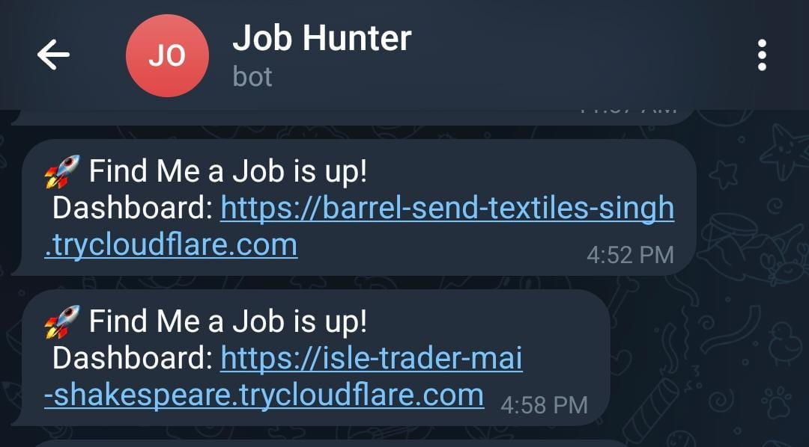
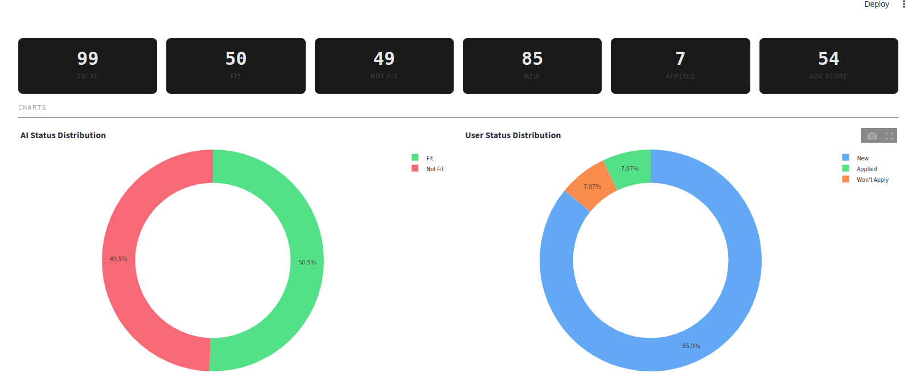
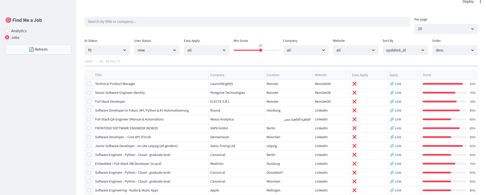

# Find Me a Job - AI-Powered Job Scraper & Matcher

An automated job scraping and AI matching pipeline that runs on a schedule, scrapes jobs from **LinkedIn** and **RemoteOK**, prevents fetching the same job twice, scores each one against your CV using an LLM, generates a cover letter for good matches, stores matched jobs in a **local SQLite database**, and serves them through a **Streamlit dashboard** with analytics, filtering, and job management. A **Cloudflare Quick Tunnel** exposes the dashboard publicly, and **Telegram notifications** send you the access URL on startup plus a summary after each run. Everything runs locally in Docker.


| LinkedIn Sub-Workflow | RemoteOK Sub-Workflow |
|:---:|:---:|
|  |  |

---

## Table of Contents

- [Features](#features)
- [Getting Started](#getting-started)
- [Configuration](#configuration)
  - [Environment Variables](#environment-variables-env)
  - [LinkedIn Search Config](#linkedin-search-config)
  - [LLM Keywords Config](#llm-keywords-config)
- [AI Scoring Logic](#ai-scoring-logic)
- [Choosing an LLM Provider](#choosing-an-llm-provider)
- [Database Schema](#database-schema)
- [Python API Reference](#python-api-reference)
- [Estimated Token Usage Per Job](#estimated-token-usage-per-job)
- [Dashboard](#dashboard)
- [Docker Services](#docker-services)
- [Download Size](#disk-footprint)
- [License](#license)

---

## Features

- **Dual source scraping** - LinkedIn (with filters) and RemoteOK, each as a modular sub-workflow
- **Multiple LinkedIn searches** - define multiple search queries (different keywords, locations, filters) in a single config file; all are executed in one run
- **Deduplication** - jobs already seen or pending are skipped automatically across runs
- **AI scoring** - scores each job 0–100 based on your CV, required skills, and years of experience; small experience gaps (1–2 years) are penalized lightly, 3+ years below means score 0
- **Cover letter generation** - only generated for jobs scoring above `FILTERING_SCORE` (default 60), saving tokens
- **Streamlit dashboard** at `localhost:8501` with analytics (stat cards, charts, daily application history) and a filterable, sortable jobs table with inline job cards and status management
- **Auto email application** - when a job listing includes an email address, the workflow sends a personalized application email with your CV attached and marks the job as `email_sent`
- **Cloudflare Quick Tunnel** - auto-creates a public `trycloudflare.com` URL for the dashboard, no account needed
- **Telegram notifications** - sends the dashboard URL on startup and a summary after each workflow run
- **LLM-powered keyword extraction** - extracts job titles and skills from your CV to filter RemoteOK results; cached and only re-extracted when the CV changes
- **Flexible LLM provider** - any OpenAI-compatible API (Groq, Google AI Studio, OpenRouter, local models, etc.)
- **Persistent storage** - SQLite with Alembic migrations applied on startup; old records purged automatically

---

## Getting Started

### Prerequisites

- [Docker](https://docs.docker.com/get-docker/) and [Docker Compose](https://docs.docker.com/compose/install/)
- An LLM API key from any OpenAI-compatible provider (e.g., [Groq](https://console.groq.com), [Google AI Studio](https://aistudio.google.com), [OpenRouter](https://openrouter.ai)) - see [Choosing an LLM Provider](#choosing-an-llm-provider)
- A [Telegram Bot](https://t.me/BotFather) - optional, for run notifications
- Your CV as a `.docx` file

### 1. Clone the repository

```bash
git clone https://github.com/yourusername/find-me-job.git
cd find-me-job
```

### 2. Set up your environment file

```bash
cp .env.example .env
```

Open `.env` and fill in your values. See [Environment Variables](#environment-variables-env) for details.

### 3. Add your CV

```bash
cp /path/to/your-cv.docx cv.docx
```

### 4. Configure your LinkedIn searches

Edit `params/linkedin_searches.txt` with your desired search parameters. See [LinkedIn Search Config](#linkedin-search-config) for the full reference.

### 5. Start the containers

```bash
docker compose up -d
```

Workflows are automatically imported into n8n on first start.

### 6. Configure n8n credentials

Open n8n at [http://localhost:5678](http://localhost:5678). The LLM config is read from your `.env`. For Telegram notifications, add a Telegram credential with `{{ $env.TELEGRAM_BOT_TOKEN }}`.

### 7. Open the dashboard

Open [http://localhost:8501](http://localhost:8501) to browse results, track applications, and view analytics. A public `trycloudflare.com` URL is also created automatically and sent to your Telegram.



---

## Configuration

### Environment Variables (`.env`)

```env
# ── n8n ─────────────────────────────────────────────
N8N_HOST=localhost
N8N_PORT=5678
N8N_PROTOCOL=http
WEBHOOK_URL=http://localhost:5678
DB_TYPE=sqlite
DB_SQLITE_DATABASE=/data/db/n8n.db
N8N_BLOCK_ENV_ACCESS_IN_NODE=false
N8N_IMPORT_WORKFLOWS_FROM=/workflows
GENERIC_TIMEZONE=Africa/Cairo

# Days before old job records are purged (default: 60)
# Cleanup runs on startup and daily at midnight
DELETE_OLD_JOBS_DAYS=60

# ── LLM ──────────────────────────────────────────────
# API key for your chosen LLM provider
LLM_API_KEY=your_api_key_here
# Must be an OpenAI-compatible chat completions endpoint
LLM_URL=https://generativelanguage.googleapis.com/v1beta/openai/chat/completions
# Model name supported by your chosen provider
LLM_MODEL=gemini-2.5-flash
# Minimum score (0–100) for a job to be saved to filtered_jobs (default: 60)
FILTERING_SCORE=60

# ── Telegram (optional) ──────────────────────────────
# Your personal Telegram user ID (get from @get_id_bot)
TELEGRAM_ID=123456789
# Bot token from @BotFather
TELEGRAM_BOT_TOKEN=xxxxxxxxx:xxxxxxxxxxxxxxxxxxxxxxxxxxxxxxxxxxx

# ── Email (optional) ─────────────────────────────────
# Set AUTO_EMAIL to any non-empty value to enable auto email applications
AUTO_EMAIL=
SMTP_HOST=smtp.gmail.com
SMTP_PORT=587
SMTP_USER=your@gmail.com
SMTP_APP_PASSWORD=your_app_password
SENDER_NAME=Your Name
```

### LinkedIn Search Config

Edit `params/linkedin_searches.txt`. The file supports **multiple searches** in a single config - the workflow loops over all entries in the `searches` array:

```json
{
  "searches": [
    {
      "Keyword": "Software Engineer",
      "Location": "Cairo, Egypt",
      "Experience Level": "Entry level, Associate",
      "Remote": "Remote, Hybrid, On-Site",
      "Job Type": "Full-time",
      "Last Posted": "r604800",
      "Easy Apply": ""
    },
    {
      "Keyword": "Software Engineer",
      "Location": "Germany",
      "Experience Level": "Entry level, Associate",
      "Remote": "Remote, Hybrid, On-Site",
      "Job Type": "Full-time",
      "Last Posted": "r604800",
      "Easy Apply": "true"
    }
  ]
}
```

Add as many search objects to the `searches` array as you need - each one runs as a separate LinkedIn query within the same workflow execution.

**Field reference:**

| Field | Example Values | Notes |
|-------|---------------|-------|
| `Keyword` | `"Python Developer"` | Job title or skill - single value |
| `Location` | `"Cairo, Egypt"` | City or country - single value |
| `Experience Level` | `"Entry level, Associate"` | Comma-separated, multiple allowed |
| `Remote` | `"Remote, Hybrid"` | Comma-separated, multiple allowed |
| `Job Type` | `"Full-time, Contract"` | Comma-separated, multiple allowed |
| `Last Posted` | `"r86400"` | `r86400`=24h, `r604800`=1 week, `r2592000`=1 month |
| `Easy Apply` | `"true"` or `""` | Any non-empty string enables it |

### LLM Keywords Config

Edit `params/llm_keywords_extract.txt` - a prompt template sent to the LLM along with your CV text. The LLM extracts:
- **`titles`** - 3–5 realistic job titles based on your experience level
- **`skills`** - 10–20 technical skills from your CV

These keywords filter RemoteOK results so only matching jobs enter the pipeline. Results are cached and only re-extracted when your CV changes.

---

## AI Scoring Logic

Each job is scored individually by the LLM using the following logic.

**Input to the model:**
- Your full CV text (extracted from `cv.docx`)
- The full job description
- Today's date (injected dynamically for calculating years of experience)

**Scoring rules:**

| Factor | Effect on Score |
|--------|----------------|
| Required skills present in CV | High positive |
| Required skills missing from CV | Negative |
| Nice-to-have skills present | Small bonus |
| Experience meets or exceeds requirement | No penalty |
| Experience 1–2 years below requirement | Slight penalty |
| Experience 3+ years below requirement | Score = 0, stop immediately |

**Output format:**
```json
{"score": 78, "coverLetter": "..."}
```

The cover letter is a 2-paragraph professional body - no name, address, or signature - so it works as a clean template you can customize before sending. Jobs scoring below `FILTERING_SCORE` (default 60) get an empty cover letter to save tokens.

---

## Choosing an LLM Provider

The workflow works with **any OpenAI-compatible API**. Configure your provider by setting three environment variables in your `.env`:

| Variable | Description | Example |
|----------|-------------|---------|
| `LLM_API_KEY` | Your API key | `gsk_xxxx`, `AIzaSy...`, `sk-...` |
| `LLM_URL` | Chat completions endpoint | See examples below |
| `LLM_MODEL` | Model identifier | See examples below |

**Provider examples:**

| Provider | `LLM_URL` | `LLM_MODEL` | Free Tier |
|----------|-----------|-------------|-----------|
| Groq | `https://api.groq.com/openai/v1/chat/completions` | `llama-3.3-70b-versatile` | Yes |
| Google AI Studio | `https://generativelanguage.googleapis.com/v1beta/openai/chat/completions` | `gemini-2.5-flash` | Yes |
| OpenRouter | `https://openrouter.ai/api/v1/chat/completions` | `meta-llama/llama-3.3-70b` | Some models |
| OpenAI | `https://api.openai.com/v1/chat/completions` | `gpt-4o` | No |
| Anthropic (via proxy) | Any OpenAI-compatible proxy URL | `claude-sonnet-4-20250514` | No |
| Local (Ollama) | `http://host.docker.internal:11434/v1/chat/completions` | `llama3` | N/A |

> **For the best scoring and cover letter quality**, consider using **Claude Sonnet** or **GPT-4o** on the paid tier. The difference in cover letter coherence and scoring nuance is significant compared to free-tier models.

---

## Database Schema

```sql
-- Jobs fully processed in previous runs (long-term deduplication)
CREATE TABLE seen_jobs (
  id       TEXT PRIMARY KEY,    -- "linkedin_4384934676" or "remoteok_1130786"
  seen_at  DATETIME DEFAULT CURRENT_TIMESTAMP
);

-- Jobs discovered this run, waiting to be scored by the LLM
CREATE TABLE pending_jobs (
  id          TEXT PRIMARY KEY,
  title       TEXT,
  company     TEXT,
  location    TEXT,
  applylink   TEXT,
  description TEXT,
  website     TEXT,             -- "linkedin" or "remoteok"
  easy_apply  BOOLEAN DEFAULT FALSE,
  created_at  DATETIME DEFAULT CURRENT_TIMESTAMP
);

-- Jobs scored by the LLM, displayed in the local dashboard
CREATE TABLE filtered_jobs (
  id           TEXT PRIMARY KEY,
  title        TEXT,
  company      TEXT,
  location     TEXT,
  applylink    TEXT,
  description  TEXT,
  website      TEXT,
  score        INTEGER,           -- 0–100 AI match score
  application_document TEXT,     -- generated cover letter / application text (nullable)
  easy_apply   BOOLEAN DEFAULT FALSE,
  ai_status    TEXT,              -- "fit" or "not_fit"
  user_status  TEXT DEFAULT 'new', -- "new", "applied", "wont_apply", or "email_sent"
  created_at   DATETIME DEFAULT CURRENT_TIMESTAMP,
  updated_at   DATETIME DEFAULT CURRENT_TIMESTAMP
);

-- CV hash and extracted keyword cache
CREATE TABLE cv_keywords (
  id         INTEGER PRIMARY KEY,
  cv_hash    TEXT NOT NULL,
  keywords   TEXT NOT NULL,
  updated_at DATETIME DEFAULT CURRENT_TIMESTAMP
);
```

Schema is managed by **Alembic migrations**, applied automatically on each container startup. Records older than `DELETE_OLD_JOBS_DAYS` (default **60**) days are automatically purged on startup and daily at midnight.

**Viewing the database:** The file lives at `./data/db/jobs.db` on your host. Open it directly in [DBeaver](https://dbeaver.io/) - select SQLite, browse to the file, and connect. No server or credentials needed.

---

## Dashboard

The project includes a **Streamlit dashboard** at [http://localhost:8501](http://localhost:8501) for browsing and managing your matched jobs.

| Analytics Tab | Jobs Tab |
|:---:|:---:|
|  |  |

- **Analytics** - stat cards, AI/user status donut charts, daily applications bar chart (last 7 days)
- **Jobs** - filterable, sortable table with inline job cards; filter by AI status, user status, easy apply, min score, company, website; search by title or company
- **Actions** - mark as applied / won't apply / email sent, reset to new, or delete
- **Defaults** - `ai_status=fit`, `user_status=new`, `min_score` from `FILTERING_SCORE`

---

## Python API Reference

The sidecar API runs on port `8001`. From n8n use `http://python-api:8001`. From your host use `http://localhost:8001`.

All endpoints are prefixed with `/api`. On startup, the API automatically runs Alembic migrations and purges old records. Old job cleanup also runs daily at midnight via a background scheduler.

**Jobs** (`/api/jobs`):

| Method | Endpoint | Params / Body | Description |
|--------|----------|---------------|-------------|
| `GET` | `/api/jobs/exists` | `?jobid=linkedin_123` | Returns `{"exists": true/false}` |
| `POST` | `/api/jobs/pending` | JSON body | Insert a new job into pending_jobs |
| `GET` | `/api/jobs/pending` | - | List all pending jobs |
| `POST` | `/api/jobs/filtered` | JSON body | Move job from pending → filtered_jobs with score and cover letter |
| `GET` | `/api/jobs/filtered` | `?ai_status=fit&user_status=new&min_score=60&search=...&company=...&website=...&sort_by=updated_at&sort_order=desc&page=1&page_size=20` | Paginated, filterable, sortable job list |
| `GET` | `/api/jobs/filtered/options` | - | Distinct company and website values for filter dropdowns |
| `GET` | `/api/jobs/filtered/{jobid}` | - | Get a single filtered job by ID |
| `PATCH` | `/api/jobs/filtered/{jobid}/status` | `{"user_status": "applied"}` | Update user tracking status (`new` / `applied` / `wont_apply` / `email_sent`) |
| `DELETE` | `/api/jobs/filtered/{jobid}` | - | Delete a job from filtered_jobs |
| `GET` | `/api/jobs/stats` | - | Aggregate counts (total, fit, not_fit, new, applied, wont_apply, email_sent, avg_score) |
| `GET` | `/api/jobs/stats/daily-applied` | `?days=7` | Daily application counts for the last N days |

**Email** (`/api/email`):

| Method | Endpoint | Params / Body | Description |
|--------|----------|---------------|-------------|
| `POST` | `/api/email/send` | JSON body | Send an application email with CV attached via SMTP |

**CV** (`/api/cv`):

| Method | Endpoint | Params / Body | Description |
|--------|----------|---------------|-------------|
| `GET` | `/api/cv` | - | Extract and return text from cv.docx |
| `GET` | `/api/cv/check/{cv_hash}` | - | Check if a CV hash exists in keyword cache |
| `GET` | `/api/cv/keywords` | - | Get cached keywords and CV hash |
| `POST` | `/api/cv/keywords` | `{"cv_hash": "...", "keywords": "..."}` | Save/update keyword cache |

**Params** (`/api/params`):

| Method | Endpoint | Description |
|--------|----------|-------------|
| `GET` | `/api/params/{name}` | Read and return `params/{name}.txt` |

### `POST /api/jobs/pending`

```json
{
  "id": "linkedin_xxxxxxxx",
  "title": "Software Engineer",
  "company": "X Corp",
  "location": "Cairo, Egypt",
  "applylink": "https://linkedin.com/jobs/view/xxxxxxxx",
  "description": "We are looking for a software engineer...",
  "website": "linkedin",
  "easy_apply": false
}
```

### `POST /api/jobs/filtered`

Same fields as pending, plus `score`, `application_document`, and `ai_status`:

```json
{
  "id": "linkedin_xxxxxxxx",
  "title": "Software Engineer",
  "company": "X Corp",
  "location": "Cairo, Egypt",
  "applylink": "https://linkedin.com/jobs/view/xxxxxxxx",
  "description": "We are looking for a software engineer...",
  "website": "linkedin",
  "score": 82,
  "application_document": "I am excited to apply for...",
  "easy_apply": false,
  "ai_status": "fit"
}
```

### `POST /api/email/send`

```json
{
  "recipient": "hiring@company.com",
  "subject": "Application for Software Engineer",
  "body": "Dear Hiring Manager,\n\nI am excited to apply for..."
}
```

The email is sent via SMTP using the credentials from your `.env` (`SMTP_HOST`, `SMTP_PORT`, `SMTP_USER`, `SMTP_APP_PASSWORD`, `SENDER_NAME`). Your `cv.docx` is automatically attached. Set `AUTO_EMAIL` to any non-empty value in `.env` to enable the n8n workflow to call this endpoint automatically when a job listing provides an email address.

---

## Estimated Token Usage Per Job

### Job scoring & cover letter (every job)

One LLM call per scraped job — scores the job against your CV and generates a cover letter for fits.

| Component | Tokens (approx) |
|-----------|----------------|
| System prompt | ~300 |
| CV text | ~500–800 |
| Job description | ~500–1,000 |
| Output (score + cover letter) | ~400–600 |
| **Total** | **~1,700–2,700** |

### Email eligibility check (fit jobs with `AUTO_EMAIL` enabled)

A second LLM call runs only on jobs that scored ≥ `FILTERING_SCORE` **and** whose description contains an email hint. It receives the job description and the cover letter from step 1, determines whether the job actually requires applying via email, and if so extracts the recipient address and generates a professional application email body.

| Component | Tokens (approx) |
|-----------|----------------|
| System prompt | ~300 |
| Job description | ~500–1,000 |
| Cover letter (from scoring step) | ~200–400 |
| Job title + company + sender name | ~20–30 |
| Output (JSON with email body or false) | ~200–400 |
| **Total** | **~1,200–2,200** |

### Summary

| Scenario | LLM Calls | Tokens per job (approx) |
|----------|-----------|------------------------|
| Scoring only (`AUTO_EMAIL` off) | 1 | ~1,700–2,700 |
| Scoring + email check (`AUTO_EMAIL` on, job has email hint) | 2 | ~2,900–4,900 |

> **Note:** The email LLM call only runs on fit jobs whose description matches an email pattern — typically a small fraction of total scraped jobs. Most jobs still consume only the scoring tokens.

---

## Docker Services

| Service | Image | Port | Purpose |
|---------|-------|------|---------|
| `n8n` | Custom (built from `n8n/Dockerfile` based on `n8nio/n8n:2.11.4`) | `5678` | Workflow automation engine with auto-import |
| `find-me-job-python-api` | Custom (built from `python-api/Dockerfile` based on `python:3.12-slim`) | `8001` | FastAPI sidecar (SQLModel ORM, Alembic migrations) for DB, CV, and params |
| `find-me-job-dashboard` | Custom (built from `dashboard/Dockerfile` based on `python:3.12-slim`) | `8501` | Streamlit dashboard for analytics and job management |
| `find-me-job-tunnel` | `cloudflare/cloudflared:2026.3.0` | `20241` | Cloudflare Quick Tunnel - exposes the dashboard via a public `trycloudflare.com` URL |

The n8n service uses a custom Docker image that automatically imports workflows from the `workflows/` directory on first start. Subsequent starts skip the import to preserve any manual changes made within n8n.

### Useful commands

```bash
docker compose up -d              # Start all services
docker compose up -d --build      # Rebuild images after code changes
docker compose logs -f python-api # Tail API logs
docker compose down               # Stop everything
docker compose down -v            # Stop and wipe all data (database + n8n state)

# Force re-import of workflows on next start
docker exec n8n rm /home/node/.n8n/.imported && docker restart n8n
```

---

## Download Size

Estimated download size on first `docker compose up -d`:

| Component | Download Size |
|-----------|---------------|
| n8n Docker image (`n8nio/n8n:2.11.4`) | ~300 MB |
| Python base image (`python:3.12-slim`) (shared by API + dashboard) | ~50 MB |
| Dashboard pip dependencies (Streamlit, Plotly) | ~50 MB |
| Cloudflared image (`cloudflare/cloudflared:2026.3.0`) | ~30 MB |
| **Total download** | **~430 MB** |

The SQLite database and n8n internal data (in `data/`) grow over time but typically stay under a few MB.

---

## License

MIT License - see [LICENSE](LICENSE) for details.
