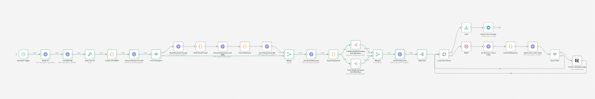
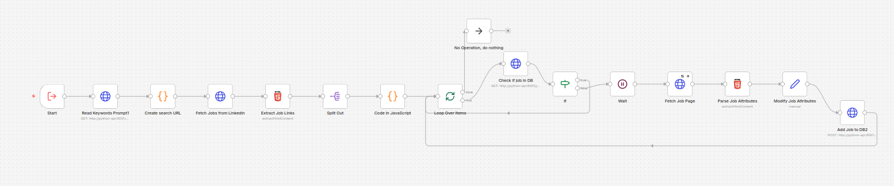
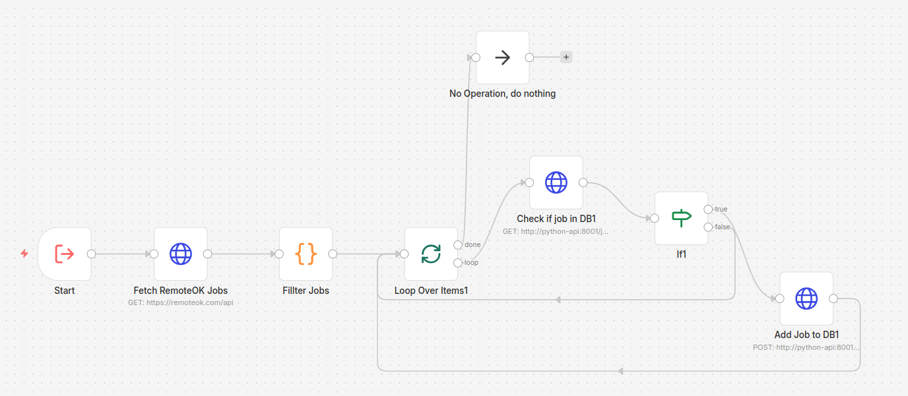

# Find Me a Job - AI-Powered Job Scraper & Matcher

An automated job scraping and AI matching pipeline that runs on a schedule, scrapes jobs from **LinkedIn** and **RemoteOK**, prevents fetching the same job twice, scores each one against your CV using an LLM, generates a cover letter for good matches, stores matched jobs in a **local SQLite database**, and serves them through a **Streamlit dashboard** with analytics, filtering, and job management - plus optional **Telegram notifications** when each run finishes. Everything runs locally in Docker.



| LinkedIn Sub-Workflow | RemoteOK Sub-Workflow |
|:---:|:---:|
|  |  |

---

## Table of Contents

- [Features](#features)
- [Getting Started](#getting-started)
- [Configuration](#configuration)
  - [Environment Variables](#environment-variables-env)
  - [LinkedIn Search Config](#linkedin-search-config)
  - [LLM Keywords Config](#llm-keywords-config)
- [AI Scoring Logic](#ai-scoring-logic)
- [Choosing an LLM Provider](#choosing-an-llm-provider)
- [Database Schema](#database-schema)
- [Python API Reference](#python-api-reference)
- [Estimated token usage per job](#estimated-token-usage-per-job)
- [Dashboard](#dashboard)
- [Docker Services](#docker-services)
- [Download Size](#disk-footprint)
- [License](#license)

---

## Features

- **Dual source scraping** - LinkedIn (with filters) and RemoteOK
- **Modular sub-workflows** - LinkedIn and RemoteOK scraping run as separate sub-workflows, called by the main workflow
- **Multiple LinkedIn searches** - define multiple search queries (different keywords, locations, filters) in a single config file and all are executed in one run
- **Deduplication** - jobs already seen or pending are skipped automatically across runs
- **AI scoring** - scores each job 0–100 based on your CV, required skills, and years of experience
- **Smart experience matching** - small experience gaps (1–2 years) don't heavily penalize the score
- **Cover letter generation** - only generated for jobs scoring above the threshold, saving tokens
- **Configurable score threshold** - set `FILTERING_SCORE` in your `.env` to control the minimum score for matched jobs and cover letter generation
- **Local Streamlit dashboard** - a built-in web dashboard at `localhost:8501` with two tabs:
  - **Analytics** - stat cards (total, fit, not fit, applied, avg score), donut charts for AI/user status distribution, and a bar chart showing daily applications over the last 7 days
  - **Jobs** - searchable, sortable, filterable table with inline job cards, status management (applied / won't apply / reset), and one-click delete
- **Advanced job filtering** - filter by AI status, user status, easy apply, min score, company, and website; search by title or company; sort by any column
- **Telegram notification** - sends you a message when the workflow finishes each run
- **Configurable search** - all LinkedIn search parameters controlled via a plain text JSON config file, no code changes needed
- **LLM-powered keyword extraction** - automatically extracts relevant job titles and skills from your CV to filter RemoteOK results
- **CV change detection** - the workflow hashes your CV on each run and compares it to the stored hash; keywords are only re-extracted when the CV actually changes, saving LLM tokens
- **Flexible LLM provider** - use any OpenAI-compatible API (Groq, Google AI Studio, OpenRouter, local models, etc.) by setting the URL, key, and model in your `.env`
- **Auto-import workflows** - workflows are automatically imported into n8n on first container start, no manual import needed
- **Rate limiting** - built-in delays between LinkedIn requests to avoid blocking
- **Persistent storage** - SQLite tracks seen and pending jobs across runs, with Alembic-managed schema migrations applied automatically on startup
- **Scheduled cleanup** - old job records (older than `DELETE_OLD_JOBS_DAYS`, default 60 days) are purged on startup and daily at midnight

---

## Getting Started

### Prerequisites

- [Docker](https://docs.docker.com/get-docker/) and [Docker Compose](https://docs.docker.com/compose/install/)
- An LLM API key from any OpenAI-compatible provider (e.g., [Groq](https://console.groq.com), [Google AI Studio](https://aistudio.google.com), [OpenRouter](https://openrouter.ai)) - see [Choosing an LLM Provider](#choosing-an-llm-provider)
- A [Telegram Bot](https://t.me/BotFather) - optional, for run notifications
- Your CV as a `.docx` file

### 1. Clone the repository

```bash
git clone https://github.com/yourusername/find-me-job.git
cd find-me-job
```

### 2. Set up your environment file

```bash
cp .env.example .env
```

Open `.env` and fill in your values. See [Environment Variables](#environment-variables-env) for details.

### 3. Add your CV

Replace the placeholder with your actual CV:

```bash
cp /path/to/your-cv.docx cv.docx
```

The Python API reads this file and extracts the text to pass to the LLM for scoring.

### 4. Configure your LinkedIn searches

Edit `params/linkedin_searches.txt` with your desired search parameters. You can define multiple searches to run in a single workflow execution. See [LinkedIn Search Config](#linkedin-search-config) for the full reference.

### 5. Start the containers

```bash
docker compose up -d
```

On first start, the custom n8n image automatically imports all workflows from the `workflows/` directory - no manual import needed.

### 6. Configure n8n credentials

1. Open n8n at [http://localhost:5678](http://localhost:5678)
2. The workflows are already imported and ready to use
3. The LLM API key, URL, and model are read automatically from your `.env`
4. For Telegram notifications, add a Telegram credential with `{{ $env.TELEGRAM_BOT_TOKEN }}`

### 7. Open the dashboard

Once jobs start flowing in, open the dashboard at [http://localhost:8501](http://localhost:8501) to browse results, track applications, and view analytics.

---

## Configuration

### Environment Variables (`.env`)

```env
# ── n8n ─────────────────────────────────────────────
N8N_HOST=localhost
N8N_PORT=5678
N8N_PROTOCOL=http
WEBHOOK_URL=http://localhost:5678
DB_TYPE=sqlite
DB_SQLITE_DATABASE=/data/db/n8n.db
N8N_BLOCK_ENV_ACCESS_IN_NODE=false
N8N_IMPORT_WORKFLOWS_FROM=/workflows
GENERIC_TIMEZONE=Africa/Cairo

# Days before old job records are purged (default: 60)
# Cleanup runs on startup and daily at midnight
DELETE_OLD_JOBS_DAYS=60

# ── LLM ──────────────────────────────────────────────
# API key for your chosen LLM provider
LLM_API_KEY=your_api_key_here
# Must be an OpenAI-compatible chat completions endpoint
LLM_URL=https://generativelanguage.googleapis.com/v1beta/openai/chat/completions
# Model name supported by your chosen provider
LLM_MODEL=gemini-2.5-flash
# Minimum score (0–100) for a job to be saved to filtered_jobs (default: 60)
FILTERING_SCORE=60

# ── Telegram (optional) ──────────────────────────────
# Your personal Telegram user ID (get from @get_id_bot)
TELEGRAM_ID=123456789
# Bot token from @BotFather
TELEGRAM_BOT_TOKEN=xxxxxxxxx:xxxxxxxxxxxxxxxxxxxxxxxxxxxxxxxxxxx
```

### LinkedIn Search Config

Edit `params/linkedin_searches.txt`. The file supports **multiple searches** in a single config - the workflow loops over all entries in the `searches` array:

```json
{
  "searches": [
    {
      "Keyword": "Software Engineer",
      "Location": "Cairo, Egypt",
      "Experience Level": "Entry level, Associate",
      "Remote": "Remote, Hybrid, On-Site",
      "Job Type": "Full-time",
      "Last Posted": "r604800",
      "Easy Apply": ""
    },
    {
      "Keyword": "Software Engineer",
      "Location": "Germany",
      "Experience Level": "Entry level, Associate",
      "Remote": "Remote, Hybrid, On-Site",
      "Job Type": "Full-time",
      "Last Posted": "r604800",
      "Easy Apply": "true"
    }
  ]
}
```

Add as many search objects to the `searches` array as you need - each one runs as a separate LinkedIn query within the same workflow execution.

**Field reference:**

| Field | Example Values | Notes |
|-------|---------------|-------|
| `Keyword` | `"Python Developer"` | Job title or skill - single value |
| `Location` | `"Cairo, Egypt"` | City or country - single value |
| `Experience Level` | `"Entry level, Associate"` | Comma-separated, multiple allowed |
| `Remote` | `"Remote, Hybrid"` | Comma-separated, multiple allowed |
| `Job Type` | `"Full-time, Contract"` | Comma-separated, multiple allowed |
| `Last Posted` | `"r86400"` | `r86400`=24h, `r604800`=1 week, `r2592000`=1 month |
| `Easy Apply` | `"true"` or `""` | Any non-empty string enables it |

### LLM Keywords Config

Edit `params/llm_keywords_extract.txt` - this file contains a prompt template that the workflow sends to the LLM along with your CV text. The LLM analyzes your CV and extracts relevant job titles and technical skills, which are then used to filter RemoteOK results so only jobs matching your profile enter the pipeline.

The prompt asks the LLM to return a JSON object with:
- **`titles`** - 3–5 realistic job titles based on your experience level
- **`skills`** - 10–20 technical skills explicitly mentioned or directly inferable from your CV

You can customize the prompt to target different roles or skill areas.

The extracted keywords are cached in the `cv_keywords` table along with a hash of your CV. On each run, the workflow compares the current CV hash to the stored one. If you update your `cv.docx`, the system detects the change automatically and re-extracts keywords. If the CV hasn't changed, it reuses the cached keywords without calling the LLM.

---

## AI Scoring Logic

Each job is scored individually by the LLM using the following logic.

**Input to the model:**
- Your full CV text (extracted from `cv.docx`)
- The full job description
- Today's date (injected dynamically for calculating years of experience)

**Scoring rules:**

| Factor | Effect on Score |
|--------|----------------|
| Required skills present in CV | High positive |
| Required skills missing from CV | Negative |
| Nice-to-have skills present | Small bonus |
| Experience meets or exceeds requirement | No penalty |
| Experience 1–2 years below requirement | Slight penalty |
| Experience 3+ years below requirement | Score = 0, stop immediately |

**Output format:**
```json
{"score": 78, "coverLetter": "..."}
```

The cover letter is a 2-paragraph professional body - no name, address, or signature - so it works as a clean template you can customize before sending. Jobs scoring below `FILTERING_SCORE` (default 60) get an empty cover letter to save tokens.

---

## Choosing an LLM Provider

The workflow works with **any OpenAI-compatible API**. Configure your provider by setting three environment variables in your `.env`:

| Variable | Description | Example |
|----------|-------------|---------|
| `LLM_API_KEY` | Your API key | `gsk_xxxx`, `AIzaSy...`, `sk-...` |
| `LLM_URL` | Chat completions endpoint | See examples below |
| `LLM_MODEL` | Model identifier | See examples below |

**Provider examples:**

| Provider | `LLM_URL` | `LLM_MODEL` | Free Tier |
|----------|-----------|-------------|-----------|
| Groq | `https://api.groq.com/openai/v1/chat/completions` | `llama-3.3-70b-versatile` | Yes |
| Google AI Studio | `https://generativelanguage.googleapis.com/v1beta/openai/chat/completions` | `gemini-2.5-flash` | Yes |
| OpenRouter | `https://openrouter.ai/api/v1/chat/completions` | `meta-llama/llama-3.3-70b` | Some models |
| OpenAI | `https://api.openai.com/v1/chat/completions` | `gpt-4o` | No |
| Anthropic (via proxy) | Any OpenAI-compatible proxy URL | `claude-sonnet-4-20250514` | No |
| Local (Ollama) | `http://host.docker.internal:11434/v1/chat/completions` | `llama3` | N/A |

> **For the best scoring and cover letter quality**, consider using **Claude Sonnet** or **GPT-4o** on the paid tier. The difference in cover letter coherence and scoring nuance is significant compared to free-tier models.

---

## Database Schema

```sql
-- Jobs fully processed in previous runs (long-term deduplication)
CREATE TABLE seen_jobs (
  id       TEXT PRIMARY KEY,    -- "linkedin_4384934676" or "remoteok_1130786"
  seen_at  DATETIME DEFAULT CURRENT_TIMESTAMP
);

-- Jobs discovered this run, waiting to be scored by the LLM
CREATE TABLE pending_jobs (
  id          TEXT PRIMARY KEY,
  title       TEXT,
  company     TEXT,
  location    TEXT,
  applylink   TEXT,
  description TEXT,
  website     TEXT,             -- "linkedin" or "remoteok"
  easy_apply  BOOLEAN DEFAULT FALSE,
  created_at  DATETIME DEFAULT CURRENT_TIMESTAMP
);

-- Jobs scored by the LLM, displayed in the local dashboard
CREATE TABLE filtered_jobs (
  id           TEXT PRIMARY KEY,
  title        TEXT,
  company      TEXT,
  location     TEXT,
  applylink    TEXT,
  description  TEXT,
  website      TEXT,
  score        INTEGER,           -- 0–100 AI match score
  cover_letter TEXT,              -- generated cover letter (nullable)
  easy_apply   BOOLEAN DEFAULT FALSE,
  ai_status    TEXT,              -- "fit" or "not_fit"
  user_status  TEXT DEFAULT 'new', -- "new", "applied", or "wont_apply"
  created_at   DATETIME DEFAULT CURRENT_TIMESTAMP,
  updated_at   DATETIME DEFAULT CURRENT_TIMESTAMP
);

-- CV hash and extracted keyword cache
CREATE TABLE cv_keywords (
  id         INTEGER PRIMARY KEY,
  cv_hash    TEXT NOT NULL,
  keywords   TEXT NOT NULL,
  updated_at DATETIME DEFAULT CURRENT_TIMESTAMP
);
```

Schema is managed by **Alembic migrations**, applied automatically on each container startup. Records older than `DELETE_OLD_JOBS_DAYS` (default **60**) days are automatically purged on startup and daily at midnight.

**Viewing the database:** The file lives at `./data/db/jobs.db` on your host. Open it directly in [DBeaver](https://dbeaver.io/) - select SQLite, browse to the file, and connect. No server or credentials needed.

---

## Dashboard

The project includes a **Streamlit dashboard** at [http://localhost:8501](http://localhost:8501) for browsing and managing your matched jobs.

### Analytics Tab

- **Stat cards** - total jobs, fit, not fit, new, applied, won't apply, and average score
- **AI Status donut chart** - fit vs not fit distribution
- **User Status donut chart** - new / applied / won't apply distribution
- **Daily Applications bar chart** - how many jobs you applied to each day over the last 7 days

### Jobs Tab

- **Search** - filter jobs by title or company name
- **Filters** - AI status, user status, easy apply, minimum score, company, website
- **Sortable table** - columns for title, company, location, website, easy apply, apply link, and score
- **Inline job card** - click any row to open a detail card beside the table with score, badges, description, cover letter, and action buttons
- **Actions** - mark as applied, won't apply, reset to new, or delete a job entirely
- **Pagination** - configurable page size (10 / 20 / 50 / 100)

Default filters are set to `ai_status=fit`, `user_status=new`, and `min_score` from your `FILTERING_SCORE` env var so you see the most relevant jobs first.

---

## Python API Reference

The sidecar API runs on port `8001`. From n8n use `http://python-api:8001`. From your host use `http://localhost:8001`.

All endpoints are prefixed with `/api`. On startup, the API automatically runs Alembic migrations and purges old records. Old job cleanup also runs daily at midnight via a background scheduler.

**Jobs** (`/api/jobs`):

| Method | Endpoint | Params / Body | Description |
|--------|----------|---------------|-------------|
| `GET` | `/api/jobs/exists` | `?jobid=linkedin_123` | Returns `{"exists": true/false}` |
| `POST` | `/api/jobs/pending` | JSON body | Insert a new job into pending_jobs |
| `GET` | `/api/jobs/pending` | - | List all pending jobs |
| `POST` | `/api/jobs/filtered` | JSON body | Move job from pending → filtered_jobs with score and cover letter |
| `GET` | `/api/jobs/filtered` | `?ai_status=fit&user_status=new&min_score=60&search=...&company=...&website=...&sort_by=updated_at&sort_order=desc&page=1&page_size=20` | Paginated, filterable, sortable job list |
| `GET` | `/api/jobs/filtered/options` | - | Distinct company and website values for filter dropdowns |
| `GET` | `/api/jobs/filtered/{jobid}` | - | Get a single filtered job by ID |
| `PATCH` | `/api/jobs/filtered/{jobid}/status` | `{"user_status": "applied"}` | Update user tracking status (`new` / `applied` / `wont_apply`) |
| `DELETE` | `/api/jobs/filtered/{jobid}` | - | Delete a job from filtered_jobs |
| `POST` | `/api/jobs/job/complete` | `?jobid=linkedin_123` | Move job from pending_jobs → seen_jobs |
| `GET` | `/api/jobs/stats` | - | Aggregate counts (total, fit, not_fit, new, applied, wont_apply, avg_score) |
| `GET` | `/api/jobs/stats/daily-applied` | `?days=7` | Daily application counts for the last N days |

**CV** (`/api/cv`):

| Method | Endpoint | Params / Body | Description |
|--------|----------|---------------|-------------|
| `GET` | `/api/cv` | - | Extract and return text from cv.docx |
| `GET` | `/api/cv/check/{cv_hash}` | - | Check if a CV hash exists in keyword cache |
| `GET` | `/api/cv/keywords` | - | Get cached keywords and CV hash |
| `POST` | `/api/cv/keywords` | `{"cv_hash": "...", "keywords": "..."}` | Save/update keyword cache |

**Params** (`/api/params`):

| Method | Endpoint | Description |
|--------|----------|-------------|
| `GET` | `/api/params/{name}` | Read and return `params/{name}.txt` |

### `/api/jobs/pending` request body

```json
{
  "id": "linkedin_xxxxxxxx",
  "title": "Software Engineer",
  "company": "X Corp",
  "location": "Cairo, Egypt",
  "applylink": "https://linkedin.com/jobs/view/xxxxxxxx",
  "description": "We are looking for a software engineer...",
  "website": "linkedin",
  "easy_apply": false
}
```

### `/api/jobs/filtered` request body

```json
{
  "id": "linkedin_xxxxxxxx",
  "title": "Software Engineer",
  "company": "X Corp",
  "location": "Cairo, Egypt",
  "applylink": "https://linkedin.com/jobs/view/xxxxxxxx",
  "description": "We are looking for a software engineer...",
  "website": "linkedin",
  "score": 82,
  "cover_letter": "I am excited to apply for...",
  "easy_apply": false,
  "ai_status": "fit"
}
```

---

## Estimated token usage per job

| Component | Tokens (approx) |
|-----------|----------------|
| System prompt | ~300 |
| CV text | ~500–800 |
| Job description | ~500–1,000 |
| Output (score + cover letter) | ~400–600 |
| **Total per job** | **~1,700–2,700** |

---

## Docker Services

| Service | Image | Port | Purpose |
|---------|-------|------|---------|
| `n8n` | Custom (built from `n8n/Dockerfile` based on `n8nio/n8n:2.11.4`) | `5678` | Workflow automation engine with auto-import |
| `find-me-job-python-api` | Custom (built from `python-api/Dockerfile` based on `python:3.12-slim`) | `8001` | FastAPI sidecar (SQLModel ORM, Alembic migrations) for DB, CV, and params |
| `find-me-job-dashboard` | Custom (built from `dashboard/Dockerfile` based on `python:3.12-slim`) | `8501` | Streamlit dashboard for analytics and job management |

The n8n service uses a custom Docker image that automatically imports workflows from the `workflows/` directory on first start. Subsequent starts skip the import to preserve any manual changes made within n8n.

### Useful commands

```bash
# Start all services (builds n8n image on first run)
docker compose up -d

# Rebuild n8n image after changes to n8n/ directory
docker compose up -d --build

# View all logs live
docker compose logs -f

# View Python API logs only
docker compose logs -f python-api

# Restart Python API after editing main.py
docker restart find-me-job-python-api

# View dashboard logs
docker compose logs -f dashboard

# Stop everything
docker compose down

# Stop and wipe all data (WARNING: deletes database and n8n workflows)
docker compose down -v

# Force re-import of workflows on next start
docker exec n8n rm /home/node/.n8n/.imported && docker restart n8n
```

---

## Download Size

Estimated download size on first `docker compose up -d`:

| Component | Download Size |
|-----------|---------------|
| n8n Docker image (`n8nio/n8n:2.11.4`) | ~300 MB |
| Python base image (`python:3.12-slim`) (shared by API + dashboard) | ~50 MB |
| Dashboard pip dependencies (Streamlit, Plotly) | ~50 MB |
| **Total download** | **~400 MB** |

The SQLite database and n8n internal data (in `data/`) grow over time but typically stay under a few MB.

---

## License

MIT License - see [LICENSE](LICENSE) for details.
