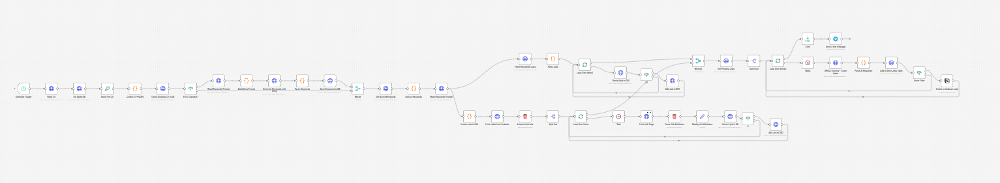
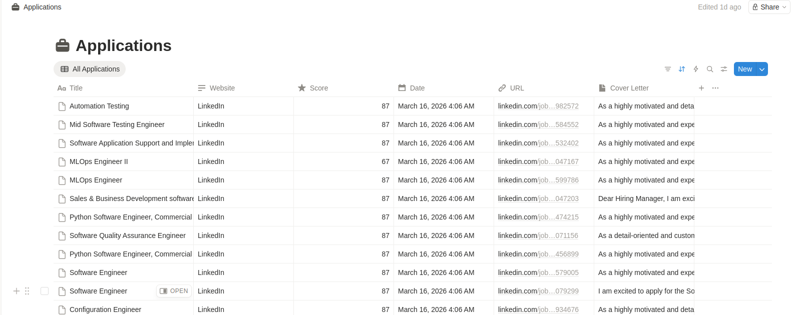
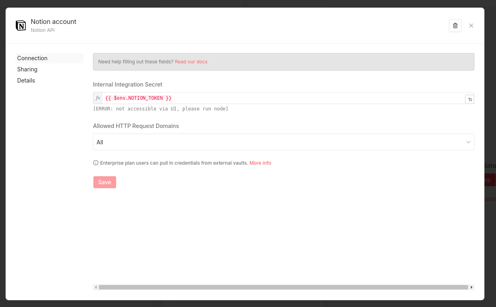
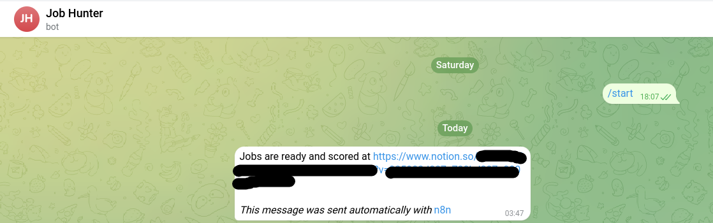

# Find Me a Job - AI-Powered Job Scraper & Matcher

An automated job scraping and AI matching pipeline that runs on a schedule, scrapes jobs from **LinkedIn** and **RemoteOK**, prevents fetching the same job twice, scores each one against your CV using an LLM, generates a cover letter for good matches, saves results to a **Notion database**, and sends you a **Telegram notification** when the workflow finishes - all running locally in Docker.



---

## Table of Contents

- [Features](#features)
- [Architecture](#architecture)
- [Project Structure](#project-structure)
- [Getting Started](#getting-started)
- [Configuration](#configuration)
  - [Environment Variables](#environment-variables-env)
  - [LinkedIn Search Config](#linkedin-search-config)
  - [LLM Keywords Config](#llm-keywords-config)
- [Notion Setup](#notion-setup)
- [AI Scoring Logic](#ai-scoring-logic)
- [Choosing an LLM Provider](#choosing-an-llm-provider)
- [Database Schema](#database-schema)
- [Python API Reference](#python-api-reference)
- [Rate Limits & Token Usage](#rate-limits--token-usage)
- [Docker Services](#docker-services)
- [Troubleshooting](#troubleshooting)
- [Screenshots](#screenshots)
- [Roadmap](#roadmap)
- [License](#license)

---

## Features

- **Dual source scraping** - LinkedIn (with filters) and RemoteOK
- **Deduplication** - jobs already seen or pending are skipped automatically across runs
- **AI scoring** - scores each job 0–100 based on your CV, required skills, and years of experience
- **Smart experience matching** - small experience gaps (1–2 years) don't heavily penalize the score
- **Cover letter generation** - only generated for jobs scoring above 50, saving tokens
- **Notion integration** - matched jobs automatically appear in your Notion database with title, score, URL, cover letter, and source
- **Telegram notification** - sends you a message when the workflow finishes each run
- **Configurable search** - all LinkedIn search parameters controlled via a plain text JSON config file, no code changes needed
- **LLM-powered keyword extraction** - automatically extracts relevant job titles and skills from your CV to filter RemoteOK results
- **CV change detection** - the workflow hashes your CV on each run and compares it to the stored hash; keywords are only re-extracted when the CV actually changes, saving LLM tokens
- **Rate limiting** - built-in delays between LinkedIn requests to avoid blocking
- **Persistent storage** - SQLite tracks seen and pending jobs across runs, with automatic cleanup of records older than 2 months

---

## Architecture

```
┌─────────────────────────────────────────────────────┐
│                     n8n Workflow                     │
│                                                      │
│  Schedule Trigger                                    │
│       │                                              │
│       ├──── LinkedIn Branch                          │
│       │     ├── Load params/linkedin_keywords.txt    │
│       │     ├── Build search URL                     │
│       │     ├── Fetch LinkedIn HTML                  │
│       │     ├── Extract job links                    │
│       │     └── Loop (with 5s delay per job)         │
│       │         ├── Fetch job page                   │
│       │         └── Parse title/company/desc         │
│       │                                              │
│       └──── RemoteOK Branch                          │
│             ├── Fetch RemoteOK API                   │
│             └── Filter + clean by keywords           │
│                                                      │
│  Merge (wait for both branches to finish)            │
│       │                                              │
│  Loop over merged jobs                               │
│       ├── Check if job exists (seen + pending DB)    │
│       ├── If new → insert into pending_jobs          │
│       └── Loop back                                  │
│                                                      │
│  Query all pending jobs from DB                      │
│       │                                              │
│  Split Out (one by one)                              │
│       ├── Wait (5s between each)                     │
│       ├── LLM: Score + Cover Letter                  │
│       ├── Parse JSON response                        │
│       ├── Score filter (≥ 50)                        │
│       │   ├── True  → Create Notion page             │
│       │   └── False → Skip                           │
│       └── Mark job as done → move to seen_jobs       │
│                                                      │
│  Telegram: Send completion notification              │
│                                                      │
└─────────────────────────────────────────────────────┘
         │                    │
         ▼                    ▼
  Python FastAPI          SQLite DB
  (sidecar API)       ┌──────────────┐
  ┌────────────────┐  │ seen_jobs    │
  │ /db/init       │  │ pending_jobs │
  │ /job/exists    │  │ cv_keywords  │
  │ /job/pending   │  └──────────────┘
  │ /job/complete  │
  │ /cv            │
  │ /param/{name}  │
  └────────────────┘
```

---

## Project Structure

```
find-me-job/
├── docker-compose.yml
├── .env                                      # Your secrets (never commit this)
├── .env.example                              # Template for environment variables
├── cv.docx                                   # Your CV/resume
├── cv.docx.example                           # Placeholder example
├── Linkedin + RemoteOK Job Search.json       # n8n workflow export (import this)
├── assets/
│   ├── n8n-workflow.png                      # n8n workflow screenshot
│   ├── notion-database.png                   # Notion database screenshot
│   ├── n8n-notion-account-setup.png          # n8n Notion credential setup
│   └── telegram-bot.png                      # Telegram notification screenshot
├── params/
│   ├── linkedin_keywords.txt                 # LinkedIn search config (JSON inside .txt)
│   └── llm_keywords_extract.txt              # LLM prompt for CV keyword extraction
├── python-api/
│   ├── main.py                               # FastAPI sidecar server
│   └── requirements.txt
└── data/                         
    ├── db/
    │   └── jobs.db                           # SQLite database
    └── n8n/                                  # n8n internal data and workflow state
```

---

## Getting Started

### Prerequisites

- [Docker](https://docs.docker.com/get-docker/) and [Docker Compose](https://docs.docker.com/compose/install/)
- A [Groq](https://console.groq.com) account - free, no credit card required (or any other LLM provider, see [Choosing an LLM Provider](#choosing-an-llm-provider))
- A [Notion](https://notion.so) account - free
- A [Telegram Bot](https://t.me/BotFather) - optional, for run notifications
- Your CV as a `.docx` file

### 1. Clone the repository

```bash
git clone https://github.com/yourusername/find-me-job.git
cd find-me-job
```

### 2. Set up your environment file

```bash
cp .env.example .env
```

Open `.env` and fill in your values. See [Environment Variables](#environment-variables-env) for details.

### 3. Add your CV

Replace the placeholder with your actual CV:

```bash
cp /path/to/your-cv.docx cv.docx
```

The Python API reads this file and extracts the text to pass to the LLM for scoring.

### 4. Configure your LinkedIn search

Edit `params/linkedin_keywords.txt` with your desired search parameters. See [LinkedIn Search Config](#linkedin-search-config) for the full reference.

### 5. Start the containers

```bash
docker compose up -d
```

### 6. Initialize the database

Run this once to create the SQLite tables:

```bash
curl -X POST http://localhost:8001/db/init
```

### 7. Import the n8n workflow

1. Open n8n at [http://localhost:5678](http://localhost:5678)
2. Go to **Workflows** → **Import from file**
3. Select `Linkedin + RemoteOK Job Search.json`
4. Update the Notion credentials and database ID in the Notion node (can also be accessed via `$env.NOTION_TOKEN` and `$env.NOTION_DB_URL`)
5. The Groq API key is read automatically from your `.env` via `$env.GROQ_API_KEY`

### 8. Set up Notion

Follow the [Notion Setup](#notion-setup) section, then activate the workflow and run it.

---

## Configuration

### Environment Variables (`.env`)

```env
# ── LLM ──────────────────────────────────────────────
# Groq API key - get free at https://console.groq.com
GROQ_API_KEY=gsk_xxxxxxxxxxxxxxxxxxxx

# ── Notion ───────────────────────────────────────────
# Get from https://www.notion.so/my-integrations
NOTION_TOKEN=ntn_xxxxxxxxxxxxxxxxxxxx
# The URL of your Notion database
NOTION_DB_URL=https://www.notion.so/xxxxxxxxxxxx?v=xxxxxxxxxxxxxxxxxxxx

# ── Telegram (optional) ──────────────────────────────
# Your personal Telegram user ID (get from @get_id_bot)
TELEGRAM_ID=123456789
# Bot token from @BotFather
TELEGRAM_BOT_TOKEN=xxxxxxxxx:xxxxxxxxxxxxxxxxxxxxxxxxxxxxxxxxxxx

# ── General ──────────────────────────────────────────
# Your local timezone for the cron scheduler
TIMEZONE=Africa/Cairo
```

### LinkedIn Search Config

Edit `params/linkedin_keywords.txt`:

```json
{
  "Keyword": "Software Engineer",
  "Location": "Cairo, Egypt",
  "Experience Level": "Entry level, Associate",
  "Remote": "Remote, Hybrid, On-Site",
  "Job Type": "Full-time",
  "Easy Apply": "true",
  "Last Posted": "r604800",

  "_meta": {
    "Easy Apply": "true to enable, empty to disable",
    "Remote": "Remote | Hybrid | On-Site (comma separated)",
    "Experience Level": "Internship | Entry level | Associate | Mid-Senior level | Director | Executive (comma separated)",
    "Last Posted": "r86400 (past 24 hours), r604800 (past week), r2592000 (past month)",
    "Keyword, Location and Last Posted": "Single value"
  }
}
```

> The `_meta` block is a reference guide for valid values - it is not used by the workflow.

**Field reference:**

| Field | Example Values | Notes |
|-------|---------------|-------|
| `Keyword` | `"Python Developer"` | Job title or skill - single value |
| `Location` | `"Cairo, Egypt"` | City or country - single value |
| `Experience Level` | `"Entry level, Associate"` | Comma-separated, multiple allowed |
| `Remote` | `"Remote, Hybrid"` | Comma-separated, multiple allowed |
| `Job Type` | `"Full-time, Contract"` | Comma-separated, multiple allowed |
| `Last Posted` | `"r86400"` | `r86400`=24h, `r604800`=1 week, `r2592000`=1 month |
| `Easy Apply` | `"true"` or `""` | Any non-empty string enables it |

### LLM Keywords Config

Edit `params/llm_keywords_extract.txt` - this file contains a prompt template that the workflow sends to the LLM along with your CV text. The LLM analyzes your CV and extracts relevant job titles and technical skills, which are then used to filter RemoteOK results so only jobs matching your profile enter the pipeline.

The prompt asks the LLM to return a JSON object with:
- **`titles`** - 3–5 realistic job titles based on your experience level
- **`skills`** - 10–20 technical skills explicitly mentioned or directly inferable from your CV

You can customize the prompt to target different roles or skill areas.

The extracted keywords are cached in the `cv_keywords` table along with a hash of your CV. On each run, the workflow compares the current CV hash to the stored one. If you update your `cv.docx`, the system detects the change automatically and re-extracts keywords. If the CV hasn't changed, it reuses the cached keywords without calling the LLM.

---

## Notion Setup

### 1. Create a Notion Integration

1. Go to [https://www.notion.so/my-integrations](https://www.notion.so/my-integrations)
2. Click **New integration**
3. Give it a name (e.g. "Job Scraper")
4. Copy the **Internal Integration Secret** → this is your `NOTION_TOKEN`

### 2. Create a Notion Database

Create a new full-page database in Notion with these exact properties:

| Property Name | Type |
|---------------|------|
| `Title` | Title |
| `Score` | Number |
| `URL` | URL |
| `Cover Letter` | Text |
| `Website` | Text |
| `Date` | Date |

> **Important:** Property names are case-sensitive and must match exactly as shown.

### 3. Share the database with your integration

Open the integration you created, go to the **Content access** tab, and add the database page you just created.

### 4. Get the Database URL

Open the database page in your browser - the URL in the address bar is your `NOTION_DB_URL`. Copy the full URL and paste it into your `.env` file.



### 5. Add credentials to n8n

In n8n, go to **Settings** → **Credentials** → **Add Credential** → **Notion API** → paste `{{ $env.NOTION_TOKEN }}` as the API key.



Repeat for Groq (`{{ $env.GROQ_API_KEY }}`) and Telegram (`{{ $env.TELEGRAM_BOT_TOKEN }}`).

---

## AI Scoring Logic

Each job is scored individually by the LLM using the following logic.

**Input to the model:**
- Your full CV text (extracted from `cv.docx`)
- The full job description
- Today's date (injected dynamically for calculating years of experience)

**Scoring rules:**

| Factor | Effect on Score |
|--------|----------------|
| Required skills present in CV | High positive |
| Required skills missing from CV | Negative |
| Nice-to-have skills present | Small bonus |
| Experience meets or exceeds requirement | No penalty |
| Experience 1–2 years below requirement | Slight penalty |
| Experience 3+ years below requirement | Score = 0, stop immediately |

**Output format:**
```json
{"score": 78, "coverLetter": "..."}
```

The cover letter is a 2-paragraph professional body - no name, address, or signature - so it works as a clean template you can customize before sending. Jobs scoring 50 or below get an empty cover letter to save tokens.

---

## Choosing an LLM Provider

The workflow uses **Groq** by default because it offers the best free tier for this use case, but you can swap it for any provider by updating the HTTP Request node in n8n.

**To switch providers**, update these fields in the LLM HTTP Request node:

| Field | Groq | Google AI Studio |
|-------|------|-----------------|
| URL | `https://api.groq.com/openai/v1/chat/completions` | `https://generativelanguage.googleapis.com/v1beta/openai/chat/completions` |
| Auth Header | `Bearer $env.GROQ_API_KEY` | `Bearer YOUR_GOOGLE_KEY` |
| Model | `llama-3.3-70b-versatile` | `gemini-2.5-flash` |

> **For the best scoring and cover letter quality**, consider using **Claude Sonnet** or **GPT-4o** on the paid tier. The difference in cover letter coherence and scoring nuance is significant compared to free-tier models.

---

## Database Schema

```sql
-- Jobs fully processed in previous runs (long-term deduplication)
CREATE TABLE seen_jobs (
  id       TEXT PRIMARY KEY,    -- "linkedin_4384934676" or "remoteok_1130786"
  seen_at  DATETIME DEFAULT CURRENT_TIMESTAMP
);

-- Jobs discovered this run, waiting to be scored by the LLM
CREATE TABLE pending_jobs (
  id          TEXT PRIMARY KEY,
  title       TEXT,
  company     TEXT,
  location    TEXT,
  applylink   TEXT,
  description TEXT,
  website     TEXT,             -- "linkedin" or "remoteok"
  created_at  DATETIME DEFAULT CURRENT_TIMESTAMP
);

-- CV hash and extracted keyword cache
CREATE TABLE cv_keywords (
  id         INTEGER PRIMARY KEY,
  cv_hash    TEXT NOT NULL,
  keywords   TEXT NOT NULL,
  updated_at DATETIME DEFAULT CURRENT_TIMESTAMP
);
```

Records older than **2 months** are automatically purged on each `/db/init` call.

**Viewing the database:** The file lives at `./data/db/jobs.db` on your host. Open it directly in [DBeaver](https://dbeaver.io/) - select SQLite, browse to the file, and connect. No server or credentials needed.

---

## Python API Reference

The sidecar API runs on port `8001`. From n8n use `http://python-api:8001`. From your host use `http://localhost:8001`.

| Method | Endpoint | Params / Body | Description |
|--------|----------|---------------|-------------|
| `POST` | `/db/init` | - | Create tables, clean records older than 2 months |
| `GET` | `/job/exists` | `?jobid=linkedin_123` | Returns `{"exists": true/false}` |
| `POST` | `/job/pending` | JSON body | Insert a new job into pending_jobs |
| `POST` | `/job/complete` | `?jobid=linkedin_123` | Move job from pending_jobs → seen_jobs |
| `GET` | `/cv` | - | Extract and return text from cv.docx |
| `GET` | `/param/{name}` | - | Read and return `params/{name}.txt` |
| `GET` | `/health` | - | Returns `{"status": "ok"}` |
| `POST` | `/query` | `{"sql": "...", "params": [...]}` | Raw SQL utility |

### `/job/pending` request body

```json
{
  "id": "linkedin_4384934676",
  "title": "Software Engineer",
  "company": "Acme Corp",
  "location": "Cairo, Egypt",
  "applylink": "https://linkedin.com/jobs/view/4384934676",
  "description": "We are looking for a software engineer...",
  "website": "linkedin"
}
```

---

## Rate Limits & Token Usage

### Groq Free Tier (`llama-3.3-70b-versatile`)

| Limit | Value |
|-------|-------|
| Requests per minute (RPM) | 30 |
| Requests per day (RPD) | 1,000 |
| Tokens per minute (TPM) | 12,000 |
| Tokens per day (TPD) | 100,000 |

### Estimated token usage per job

| Component | Tokens (approx) |
|-----------|----------------|
| System prompt | ~300 |
| CV text | ~500–800 |
| Job description | ~500–1,000 |
| Output (score + cover letter) | ~400–600 |
| **Total per job** | **~1,700–2,700** |

At ~2,200 tokens average, the 100K TPD limit supports roughly **45 jobs per day**. If you regularly exceed this, switch to `meta-llama/llama-4-scout-17b-16e-instruct` which has a 500K TPD limit on the same free Groq tier.

---

## Docker Services

| Service | Image | Port | Purpose |
|---------|-------|------|---------|
| `n8n` | `n8nio/n8n:2.11.4` | `5678` | Workflow automation engine |
| `find-me-job-python-api` | `python:3.11-slim` | `8001` | FastAPI sidecar for DB, CV, and params |

### Useful commands

```bash
# Start all services
docker compose up -d

# View all logs live
docker compose logs -f

# View Python API logs only
docker compose logs -f python-api

# Restart Python API after editing main.py
docker restart find-me-job-python-api

# Stop everything
docker compose down

# Stop and wipe all data (WARNING: deletes database and n8n workflows)
docker compose down -v
```

---

## Troubleshooting

**`database is locked` error**
The API uses WAL mode and a threading lock to prevent this. If it still occurs, restart the container:
```bash
docker restart find-me-job-python-api
```

**Jobs not appearing in Notion**
Jobs scoring below 50 are intentionally skipped. Lower the threshold in the Score Filter If node if needed. Check the n8n execution log to see the scores being assigned.

**Telegram notification not sending**
- `TELEGRAM_ID` must be your numeric user ID, not your username - get it from [@get_id_bot](https://t.me/get_id_bot)
- You must start a conversation with your bot at least once before it can message you

**n8n can't reach the Python API**
- Make sure both containers are running: `docker compose ps`
- From inside n8n, the API URL is `http://python-api:8001`, not `localhost`
- Check Python API logs for startup errors: `docker compose logs python-api`

**LinkedIn returning empty results**
- LinkedIn may temporarily block scraping if too many requests are made. The workflow includes built-in delays, but if you see empty results, wait a few hours before retrying.
- Verify your search parameters in `params/linkedin_keywords.txt` return results when searched manually on LinkedIn.

---

## Screenshots

### n8n Workflow

The full automation pipeline in n8n - from scraping to scoring to Notion:


### Notion Database

Matched jobs with scores and cover letters, ready to review:


### n8n Credential Setup

How to configure the Notion API credential in n8n using environment variables:


### Telegram Notification

The bot sends you a message with a link to your Notion database when a run completes:



---

## Roadmap

- [ ] Add more job sources (Indeed, Glassdoor, Wuzzuf)
- [ ] Web dashboard to view and manage matched jobs
- [ ] Email notification support as alternative to Telegram
- [ ] Support for multiple CV profiles (e.g., backend vs. full-stack)
- [ ] Auto-apply integration for Easy Apply jobs
- [ ] Score threshold configurable via environment variable
- [ ] Historical analytics - track scores and match rates over time

---

## License

MIT License - see [LICENSE](LICENSE) for details.
