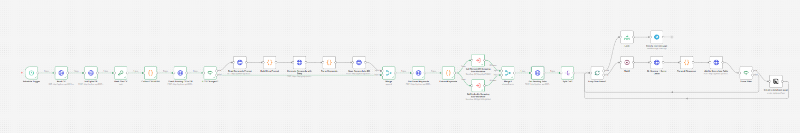
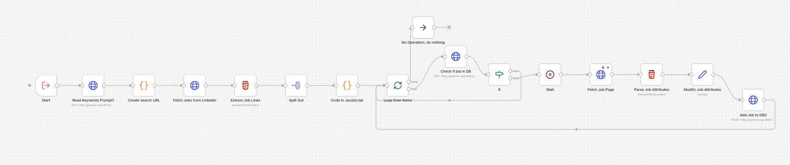
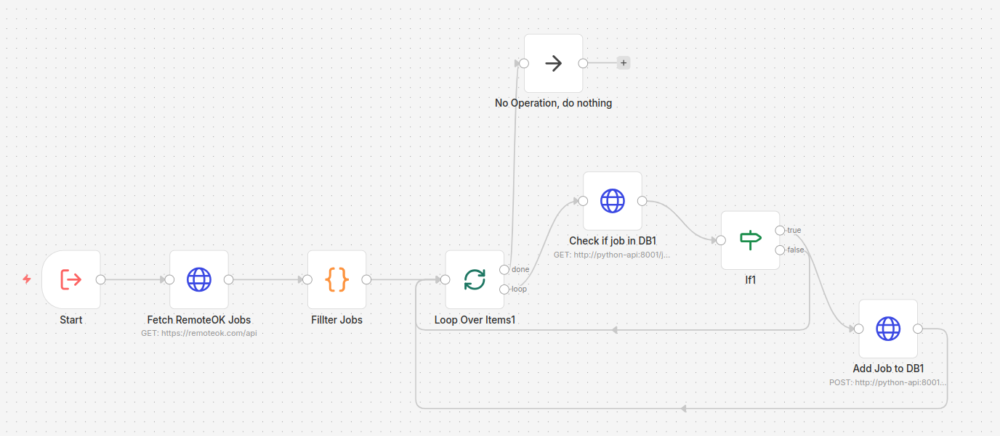
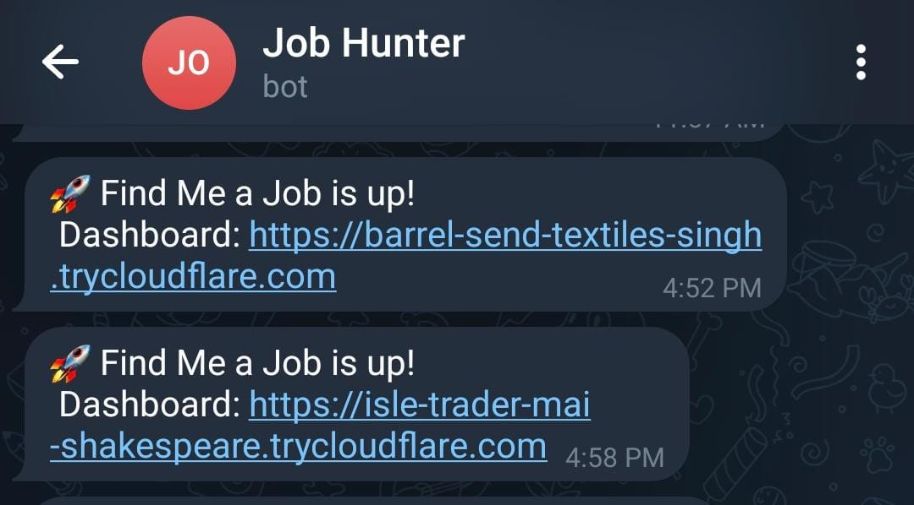
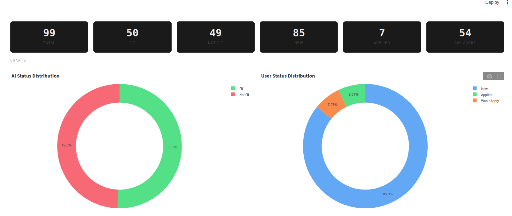
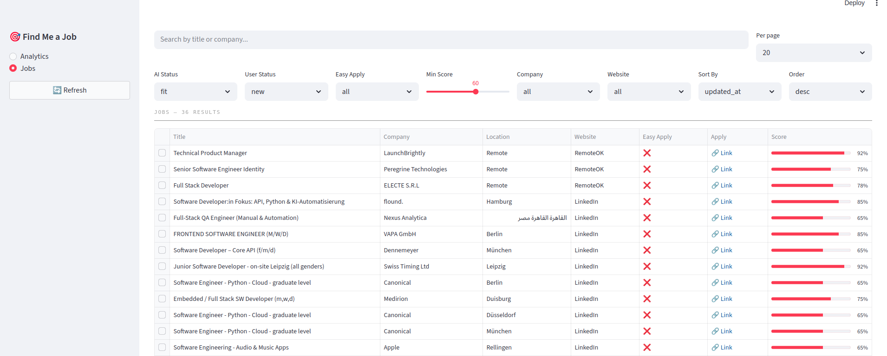

# Find Me a Job - AI-Powered Job Scraper & Matcher

An automated job scraping and AI matching pipeline that runs on a schedule, scrapes jobs from **LinkedIn** and **RemoteOK**, prevents fetching the same job twice, scores each one against your CV using an LLM, generates a cover letter for good matches, stores matched jobs in a **local SQLite database**, and serves them through a **Streamlit dashboard** with analytics, filtering, and job management. A **Cloudflare Quick Tunnel** exposes the dashboard publicly, and **Telegram notifications** send you the access URL on startup plus a summary after each run. Everything runs locally in Docker.



| LinkedIn Sub-Workflow | RemoteOK Sub-Workflow |
|:---:|:---:|
|  |  |

---

## Table of Contents

- [Features](#features)
- [Getting Started](#getting-started)
- [Configuration](#configuration)
  - [Environment Variables](#environment-variables-env)
  - [LinkedIn Search Config](#linkedin-search-config)
  - [LLM Keywords Config](#llm-keywords-config)
- [AI Scoring Logic](#ai-scoring-logic)
- [Choosing an LLM Provider](#choosing-an-llm-provider)
- [Database Schema](#database-schema)
- [Dashboard](#dashboard)
  - [Settings tab](#settings-tab)
  - [Blocking companies](#blocking-companies)
- [Python API Reference](#python-api-reference)
- [Estimated Token Usage Per Job](#estimated-token-usage-per-job)
- [Docker Services](#docker-services)
- [Download Size](#download-size)
- [License](#license)

---

## Features

- **Dual source scraping** - LinkedIn (with filters) and RemoteOK, each as a modular sub-workflow
- **Multiple LinkedIn searches** - define multiple search queries (different keywords, locations, filters) in a single config file; all are executed in one run
- **Deduplication** - jobs already seen or pending are skipped automatically across runs
- **AI scoring** - scores each job 0–100 based on your CV, required skills, and years of experience; small experience gaps (1–2 years) are penalized lightly, 3+ years below means score 0
- **Cover letter generation** - only generated for jobs scoring above `FILTERING_SCORE` (default 60), saving tokens
- **Streamlit dashboard** at `localhost:8501` with analytics (stat cards, charts, a year-long activity heatmap), a scannable job list with a detail panel, quick-filter views, bulk actions, a combined starred/blocked companies list, and manual job entry
- **Auto email application** - when a job listing includes an email address, the workflow sends a personalized application email with your CV attached and marks the job as `email_sent`
- **Cloudflare Quick Tunnel** - auto-creates a public `trycloudflare.com` URL for the dashboard, no account needed
- **Telegram notifications** - sends the dashboard URL on startup and a summary after each workflow run
- **LLM-powered keyword extraction** - extracts job titles and skills from your CV to filter RemoteOK results; cached and only re-extracted when the CV changes
- **Flexible LLM provider** - any OpenAI-compatible API (Groq, Google AI Studio, OpenRouter, local models, etc.)
- **Company blocklist** - block a company and its jobs are dropped before they ever reach the LLM, so they cost nothing
- **Starred companies** - keep a watchlist with careers URLs and notes; starred jobs are flagged with ★ and get their own view
- **Settings tab** - upload your CV, edit search config, trigger a run, export your data, and download a database backup without leaving the dashboard
- **Run history** - every workflow run is recorded with counts and errors, so a silent failure is visible
- **Persistent storage** - SQLite with Alembic migrations applied on startup; old records purged automatically

---

## Getting Started

### Prerequisites

- [Docker](https://docs.docker.com/get-docker/) and [Docker Compose](https://docs.docker.com/compose/install/)
- An LLM API key from any OpenAI-compatible provider (e.g., [Groq](https://console.groq.com), [Google AI Studio](https://aistudio.google.com), [OpenRouter](https://openrouter.ai)) - see [Choosing an LLM Provider](#choosing-an-llm-provider)
- A [Telegram Bot](https://t.me/BotFather) - optional, for run notifications
- Your CV as a `.docx` file

### 1. Clone the repository

```bash
git clone https://github.com/yourusername/find-me-job.git
cd find-me-job
```

### 2. Configure and start

```bash
cp .env.example .env      # then fill in your values
chmod 600 .env            # it will hold your API keys
cp /path/to/your-cv.docx cv.docx   # must exist before start: bind-mounted as a file
docker compose up -d --build
```

See [Environment Variables](#environment-variables-env) for what each setting does. At minimum
you need `LLM_API_KEY`, `LLM_URL` and `LLM_MODEL`; Telegram and email are optional.

### 3. Open the dashboard

Open [http://localhost:8501](http://localhost:8501). Everything else is configurable from the **Settings** tab — upload your CV, edit your LinkedIn searches, and trigger a run without ever opening n8n.

A public `trycloudflare.com` URL is also created automatically and sent to your Telegram.

### 4. Activate the workflow (one time)

Open n8n at [http://localhost:5678](http://localhost:5678) — or click **Open n8n** in the dashboard's Settings tab — and toggle **Scraping Main Workflow** to **Active**. This registers the schedule and the webhook that the dashboard's **Run now** button calls.

For Telegram notifications, create a Telegram credential named `Telegram account` with `{{ $env.TELEGRAM_BOT_TOKEN }}` before activating. The LLM config is read from your `.env` automatically.



---

## Configuration

### Environment Variables (`.env`)

```env
# ── n8n ─────────────────────────────────────────────
N8N_HOST=localhost
N8N_PORT=5678
N8N_PROTOCOL=http
WEBHOOK_URL=http://localhost:5678
DB_TYPE=sqlite
DB_SQLITE_DATABASE=/data/db/n8n.db
N8N_BLOCK_ENV_ACCESS_IN_NODE=false
N8N_IMPORT_WORKFLOWS_FROM=/workflows
GENERIC_TIMEZONE=Africa/Cairo

# Cap n8n execution history so data/db/n8n.db does not grow without bound
EXECUTIONS_DATA_PRUNE=true
EXECUTIONS_DATA_MAX_AGE=168
EXECUTIONS_DATA_PRUNE_MAX_COUNT=5000

# Silence n8n telemetry/version pings (pure log noise on a personal instance)
N8N_DIAGNOSTICS_ENABLED=false
N8N_VERSION_NOTIFICATIONS_ENABLED=false
N8N_TEMPLATES_ENABLED=false

# Days before old job records are purged (default: 60)
# Cleanup runs on startup and daily at midnight, in GENERIC_TIMEZONE
DELETE_OLD_JOBS_DAYS=60

# Host user id the API/dashboard containers run as; must own ./data (run: id -u)
APP_UID=1000

# Where the dashboard's "Open n8n" button points (must be reachable from your browser)
N8N_PUBLIC_URL=http://localhost:5678
# Webhook path the "Run now" button calls on the main workflow
N8N_RUN_WEBHOOK_PATH=find-me-job-run

# ── LLM ──────────────────────────────────────────────
# API key for your chosen LLM provider
LLM_API_KEY=your_api_key_here
# Must be an OpenAI-compatible chat completions endpoint
LLM_URL=https://generativelanguage.googleapis.com/v1beta/openai/chat/completions
# Model name supported by your chosen provider
LLM_MODEL=gemini-2.5-flash   # any model your provider supports
# Minimum score (0–100) for a job to be saved to filtered_jobs (default: 60)
FILTERING_SCORE=60

# ── Telegram (optional) ──────────────────────────────
# Your personal Telegram user ID (get from @get_id_bot)
TELEGRAM_ID=123456789
# Bot token from @BotFather
TELEGRAM_BOT_TOKEN=xxxxxxxxx:xxxxxxxxxxxxxxxxxxxxxxxxxxxxxxxxxxx

# ── Email (optional) ─────────────────────────────────
# Set AUTO_EMAIL to any non-empty value to enable auto email applications
AUTO_EMAIL=
SMTP_HOST=smtp.gmail.com
SMTP_PORT=587
SMTP_USER=your@gmail.com
SMTP_APP_PASSWORD=your_app_password
SENDER_NAME=Your Name
```

### LinkedIn Search Config

Edit your searches in the dashboard **Settings** tab, or in `params/linkedin_searches.txt`
directly. That file is git-ignored because it is per-user; the API creates it with a default
on first start. It supports **multiple searches** in a single config - the workflow loops over all entries in the `searches` array:

```json
{
  "searches": [
    {
      "Keyword": "Software Engineer",
      "Location": "Cairo, Egypt",
      "Experience Level": "Entry level, Associate",
      "Remote": "Remote, Hybrid, On-Site",
      "Job Type": "Full-time",
      "Last Posted": "r604800",
      "Easy Apply": ""
    },
    {
      "Keyword": "Software Engineer",
      "Location": "Germany",
      "Experience Level": "Entry level, Associate",
      "Remote": "Remote, Hybrid, On-Site",
      "Job Type": "Full-time",
      "Last Posted": "r604800",
      "Easy Apply": "true"
    }
  ]
}
```

Add as many search objects to the `searches` array as you need - each one runs as a separate LinkedIn query within the same workflow execution.

**Field reference:**

| Field | Example Values | Notes |
|-------|---------------|-------|
| `Keyword` | `"Python Developer"` | Job title or skill - single value |
| `Location` | `"Cairo, Egypt"` | City or country - single value |
| `Experience Level` | `"Entry level, Associate"` | Comma-separated, multiple allowed |
| `Remote` | `"Remote, Hybrid"` | Comma-separated, multiple allowed |
| `Job Type` | `"Full-time, Contract"` | Comma-separated, multiple allowed |
| `Last Posted` | `"r86400"` | `r86400`=24h, `r604800`=1 week, `r2592000`=1 month |
| `Easy Apply` | `"true"` or `""` | Any non-empty string enables it |

### LLM Keywords Config

Edit `params/llm_keywords_extract.txt` - a prompt template sent to the LLM along with your CV text. The LLM extracts:
- **`titles`** - 3–5 realistic job titles based on your experience level
- **`skills`** - 10–20 technical skills from your CV

These keywords filter RemoteOK results so only matching jobs enter the pipeline. Results are cached and only re-extracted when your CV changes.

---

## AI Scoring Logic

Each job is scored individually by the LLM using the following logic.

**Input to the model:**
- Your full CV text (extracted from `cv.docx`)
- The full job description
- Today's date (injected dynamically for calculating years of experience)

**Scoring rules:**

| Factor | Effect on Score |
|--------|----------------|
| Required skills present in CV | High positive |
| Required skills missing from CV | Negative |
| Nice-to-have skills present | Small bonus |
| Experience meets or exceeds requirement | No penalty |
| Experience 1–2 years below requirement | Slight penalty |
| Experience 3+ years below requirement | Score = 0, stop immediately |

**Output format:**
```json
{"score": 78, "coverLetter": "..."}
```

The cover letter is a 2-paragraph professional body - no name, address, or signature - so it works as a clean template you can customize before sending. Jobs scoring below `FILTERING_SCORE` (default 60) get an empty cover letter to save tokens.

---

## Choosing an LLM Provider

The workflow works with **any OpenAI-compatible API**. Configure your provider by setting three environment variables in your `.env`:

| Variable | Description | Example |
|----------|-------------|---------|
| `LLM_API_KEY` | Your API key | `gsk_xxxx`, `AIzaSy...`, `sk-...` |
| `LLM_URL` | Chat completions endpoint | See examples below |
| `LLM_MODEL` | Model identifier | See examples below |

**Provider examples:**

| Provider | `LLM_URL` | `LLM_MODEL` | Free Tier |
|----------|-----------|-------------|-----------|
| Groq | `https://api.groq.com/openai/v1/chat/completions` | `llama-3.3-70b-versatile` | Yes |
| Google AI Studio | `https://generativelanguage.googleapis.com/v1beta/openai/chat/completions` | `gemini-2.5-flash` | Yes |
| OpenRouter | `https://openrouter.ai/api/v1/chat/completions` | `meta-llama/llama-3.3-70b` | Some models |
| OpenAI | `https://api.openai.com/v1/chat/completions` | `gpt-4o` | No |
| Anthropic (via proxy) | Any OpenAI-compatible proxy URL | `claude-sonnet-4-20250514` | No |
| Local (Ollama) | `http://host.docker.internal:11434/v1/chat/completions` | `llama3` | N/A |

> **For the best scoring and cover letter quality**, consider using **Claude Sonnet** or **GPT-4o** on the paid tier. The difference in cover letter coherence and scoring nuance is significant compared to free-tier models.

---

## Database Schema

```sql
-- Jobs fully processed in previous runs (long-term deduplication)
CREATE TABLE seen_jobs (
  id       TEXT PRIMARY KEY,    -- "linkedin_4384934676" or "remoteok_1130786"
  seen_at  DATETIME DEFAULT CURRENT_TIMESTAMP
);

-- Jobs discovered this run, waiting to be scored by the LLM
CREATE TABLE pending_jobs (
  id          TEXT PRIMARY KEY,
  title       TEXT,
  company     TEXT,
  location    TEXT,
  applylink   TEXT,
  description TEXT,
  website     TEXT,             -- "linkedin" or "remoteok"
  easy_apply  BOOLEAN DEFAULT FALSE,
  created_at  DATETIME DEFAULT CURRENT_TIMESTAMP
);

-- Jobs scored by the LLM, displayed in the local dashboard
CREATE TABLE filtered_jobs (
  id           TEXT PRIMARY KEY,
  title        TEXT,
  company      TEXT,
  location     TEXT,
  applylink    TEXT,
  description  TEXT,
  website      TEXT,
  score        INTEGER,           -- 0–100 AI match score
  application_document TEXT,     -- generated cover letter / application text (nullable)
  easy_apply   BOOLEAN DEFAULT FALSE,
  ai_status    TEXT,              -- "fit" or "not_fit"
  user_status  TEXT DEFAULT 'new', -- see the user status list below
  created_at   DATETIME DEFAULT CURRENT_TIMESTAMP,
  updated_at   DATETIME DEFAULT CURRENT_TIMESTAMP
);

-- Every user_status transition, for the job card timeline
CREATE TABLE job_status_history (
  id         INTEGER PRIMARY KEY,
  job_id     TEXT REFERENCES filtered_jobs(id),
  status     TEXT NOT NULL,
  changed_at DATETIME DEFAULT CURRENT_TIMESTAMP
);

-- Companies you starred in the dashboard (names stored lowercase)
CREATE TABLE starred_companies (
  id           INTEGER PRIMARY KEY,
  company_name TEXT NOT NULL UNIQUE,
  careers_url  TEXT,
  notes        TEXT,
  created_at   DATETIME DEFAULT CURRENT_TIMESTAMP
);

-- CV hash and extracted keyword cache
CREATE TABLE cv_keywords (
  id         INTEGER PRIMARY KEY,
  cv_hash    TEXT NOT NULL,
  keywords   TEXT NOT NULL,
  updated_at DATETIME DEFAULT CURRENT_TIMESTAMP
);
```

```sql
-- Companies whose jobs are dropped before scoring
CREATE TABLE blocked_companies (
  id           INTEGER PRIMARY KEY,
  company_name TEXT NOT NULL UNIQUE,   -- lowercase
  reason       TEXT,
  created_at   DATETIME DEFAULT CURRENT_TIMESTAMP
);

-- One row per workflow run, for the dashboard's run history
CREATE TABLE workflow_runs (
  id           INTEGER PRIMARY KEY,
  trigger      TEXT,                   -- "schedule" or "manual"
  status       TEXT,                   -- "running", "success", "failed"
  started_at   DATETIME,
  finished_at  DATETIME,
  jobs_scraped INTEGER DEFAULT 0,
  jobs_scored  INTEGER DEFAULT 0,
  jobs_matched INTEGER DEFAULT 0,
  error        TEXT
);
```

**User statuses:** `new`, `applied`, `email_sent`, `referral`, `assessment`, `interview`, `offer`, `rejected`, `wont_apply`. The analytics treat `applied`, `email_sent`, and `referral` as the "applied" bucket.

Schema is managed by **Alembic migrations**, applied automatically on each container startup. A brand-new database is created directly from the models and stamped at the current revision, so a fresh clone starts cleanly. `filtered_jobs` is indexed on every column the dashboard filters and sorts by, so page loads stay fast as the table grows. Records older than `DELETE_OLD_JOBS_DAYS` (default **60**) days are automatically purged on startup and daily at midnight.

**Viewing the database:** The file lives at `./data/db/jobs.db` on your host. Open it directly in [DBeaver](https://dbeaver.io/) - select SQLite, browse to the file, and connect. No server or credentials needed.

---

## Dashboard

The project includes a **Streamlit dashboard** at [http://localhost:8501](http://localhost:8501) for browsing and managing your matched jobs.

| Analytics Tab | Jobs Tab |
|:---:|:---:|
|  |  |

> The screenshots above predate the current visual design.

The interface uses a single validated colour palette defined in `dashboard/src/theme.py`.
Categorical hues are assigned in fixed order, magnitude always uses one hue getting
darker (never a red-to-green rainbow), and the theme is pinned in
`dashboard/.streamlit/config.toml`. Charts carry legends and direct labels, so colour
never carries meaning on its own.

### One vocabulary

Every screen uses these words for these sets, and every count comes from one
function (`dashboard/src/library.py`) so two pages can never disagree:

| Term | Means |
|------|-------|
| **Queued** | Scraped, waiting for the scorer — a row in `pending_jobs`, not yet in Jobs |
| **Scored** | A row in `filtered_jobs` with a match score |
| **Matched** | Scored at or above `FILTERING_SCORE`. The scorer writes `ai_status="fit"` at exactly that line, so *Matched* and *at or above the cutoff* are the same set |
| **Strong match** | Scored 80 or above |
| **New** | Scored, still at application status *New* |
| **Status** | Where your application stands: New → Applied → … → Offer / Rejected |

Score bands are identical everywhere — **≥ 80 strong**, **≥ cutoff matched**,
**below cutoff** — and the same chip renders them in the list, the detail and the
histogram.

### Sidebar

Navigation with live counts, and the health of the pipeline on every page:

```
● Workflow inactive
Queue 53
Last run never
Counts updated just now
```

**Public link** sits underneath and states what it exposes before it shows you the
URL: a Cloudflare quick tunnel serves the whole dashboard — CV download, every job,
your statuses, and Settings including the danger zone — to anyone with the link, with
no password.

### Pages

- **Analytics** — six KPI tiles, then **Needs attention**: real conditions with somewhere to go (*"the workflow is inactive and 53 jobs are waiting"*, *"5 strong matches you have not opened"*), each of which hides itself once it stops being true. Then the full chart set — match rate, score distribution with your cutoff and median drawn on it, conversion funnel, status breakdown, applications by source, companies by best score, and a 365-day activity calendar
- **Jobs** — a scannable list. Six view chips (**All**, **Matched**, **Strong**, **New**, **⚡ Easy Apply**, **★ Starred**) with live counts, a search box, a sort control, and a **Filters** popover holding a score range, application status, AI verdict, source, location and company
- **Companies** — one compact table covering both lists, with **jobs seen**, **best score** and **last seen** pulled from your jobs table
- **Settings** — a control room: run the workflow, replace the CV, edit searches, export, and read run history

Working with jobs:

- **Defaults are neutral.** Nothing is filtered until you filter it, so a list labelled *All* is never a filtered list
- **Active filters are always visible** as removable chips under the search bar, and the count line states the remainder: `Showing 5 of 5 jobs · 5 hidden by filters`
- **Score chip** — one band-coloured number, no progress bar. At 95 / 90 / 90 / 85 / 80 the bars were the same bar
- **Why this score** — each row lists the CV skills the posting actually names, and the detail dialog leads with them. This is a keyword overlap against the skills extracted from your CV, not the scorer's reasoning: the scoring step records a score and a cover letter and no rationale, and the UI says so
- **Status from the row** — set Applied without opening anything. This is what feeds the funnel, the status breakdown and the activity calendar
- **Row link** — the ↗ at the right of every row opens the posting in a new tab. It sits at the same x on every row, so it is a fixed target
- **Detail panel** — click a title and it opens in a column beside the list, not a modal over it: nothing dims, and the rows stay readable for comparison. It only exists once a job is picked, so an unopened list keeps the full width and opening one widens the page rather than halving the list. The panel is sticky, so it stays level with you as you scroll. Inside: match evidence, apply link, star/block, status, the description with its bullets restored and your matched skills highlighted, the generated application document with a one-click PDF export, and a timeline of every status change
- **Bulk actions** — flip the **Select** toggle, tick rows, then set a status, star/unstar, block, or delete them in one go
- **Add job** — for a job you found yourself, so it shows up in the pipeline and analytics

Working with companies:

- **The effect is stated on the page.** Starring marks a company and gives it its own view; it does **not** change scoring. Blocking drops new postings before the scorer sees them, so they never cost an LLM call — jobs already in your list stay
- **Add from your jobs** — the Add dialog opens on the companies already in your database, with each one's best score and job count, so a list cannot fragment into `TP` and `TP Egypt` through hand-typing. A manual tab sits behind it
- **Absences stay quiet** — an empty cell rather than *"Careers URL not set"*

### Settings tab

A control room rather than a preferences pane. A live status strip sits above five tabs:

**Status strip** — polls in an `st.fragment`, so it updates without rerunning the page
or losing your scroll position. It reads the same counts as the sidebar and Analytics:

| Readout | Source |
|---------|--------|
| **Workflow** | `Active` / `Inactive` / `Unknown` from a side-effect-free webhook probe. Set `N8N_API_KEY` for a definitive answer via n8n's REST API |
| **n8n** | `Up` / `Down` from `/healthz` — whether the service itself is answering, which is a different question from whether the workflow is switched on |
| **Last run** | Newest row in `workflow_runs` — status, relative time, scored/matched counts, duration |
| **Scored** | `filtered_jobs` total, with the matched count underneath |
| **Queue** | `pending_jobs` depth — the number that moves while a run is in flight |

| Tab | What it does |
|-----|--------------|
| **Workflow** | **Run now** POSTs to the webhook and narrates the attempt in an `st.status`. When n8n is unreachable or the workflow is switched off it is disabled, with an inline warning and an **Activate in n8n** link — rather than a lit button that would 404. Failures become a persistent block naming the cause |
| **CV** | `cv.docx · 2.6 MB · file changed 27 Mar 2026 (4mo ago)`, the extracted titles and skills as chips (`4 titles · 18 skills · extracted 5mo ago` — a different event, so a different label), a download button, and the uploader collapsed behind **Replace CV** with a size diff and an explicit confirm |
| **Searches** | `params/linkedin_searches.txt` as an editable table — one row per LinkedIn query, with `f_TPR` values shown as *Past week* and Easy Apply as a checkbox. The keyword-extraction prompt sits below it. **Save changes** stays disabled until something actually changes, and the heading turns to `● Unsaved changes` when it does |
| **Data** | One export control (CSV/JSON × matched/all) that states row count and estimated size before you click, plus a one-click DB backup. Both generate lazily, so opening the tab exports nothing. Backups stream to your browser and are not kept server-side, which the tab says rather than leaving you to wonder where the history is |
| **History** | Runs table with a matched-per-run sparkline, a failed-only filter, and row-select for the raw run record. Empty until the workflow reports in — the empty state says exactly what to check |

The **Danger zone** at the bottom of **Data** clears the jobs table. It requires typing
`delete all jobs` and states the blast radius first. Note that the Cloudflare tunnel exposes the
dashboard without authentication — if you share that URL, you share this button too.

### Blocking companies

Blocking is enforced in the API at `POST /api/jobs/pending`, not in the scrapers — so every
source gets it automatically and a blocked company never costs an LLM call. Blocked jobs are
still recorded in `seen_jobs` so they are not re-fetched on every run, which means unblocking
affects future postings rather than retroactively restoring old ones.

The page auto-refreshes every 5 minutes. API responses are cached briefly in the dashboard, so a refresh does not re-query everything; any action you take clears the caches it affects.

---

## Python API Reference

The sidecar API runs on port `8001`. From n8n use `http://python-api:8001`. From your host use `http://localhost:8001`.

All endpoints are prefixed with `/api`. On startup, the API automatically runs Alembic migrations and purges old records. Old job cleanup also runs daily at midnight via a background scheduler.

**Jobs** (`/api/jobs`):

| Method | Endpoint | Params / Body | Description |
|--------|----------|---------------|-------------|
| `GET` | `/api/jobs/exists` | `?jobid=linkedin_123` | Returns `{"exists": true/false}` |
| `POST` | `/api/jobs/pending` | JSON body | Insert a new job into pending_jobs |
| `GET` | `/api/jobs/pending` | - | List all pending jobs |
| `POST` | `/api/jobs/filtered` | JSON body | Move job from pending → filtered_jobs with score and cover letter |
| `GET` | `/api/jobs/filtered` | `?ai_status=fit&user_status=new&easy_apply=true&min_score=0&max_score=100&search=...&company=...&website=...&location=...&starred_only=false&sort_by=updated_at&sort_order=desc&page=1&page_size=20&include_body=true&include_keywords=false` | Paginated, filterable, sortable job list. `include_body=false` omits `description` and `application_document` — the dashboard uses this for the list and fetches the full record only when you open a job. `include_keywords=true` adds a `keywords` array per row — the CV skills that appear in that posting. `page_size` is capped at 200. |
| `GET` | `/api/jobs/filtered/options` | - | Distinct company and website values for filter dropdowns |
| `GET` | `/api/jobs/filtered/{jobid}` | - | Get a single filtered job by ID |
| `PATCH` | `/api/jobs/filtered/{jobid}/status` | `{"user_status": "applied"}` | Update user tracking status (see the [user status list](#database-schema)) |
| `GET` | `/api/jobs/filtered/{jobid}/history` | - | Full `user_status` transition timeline for one job |
| `GET` | `/api/jobs/filtered/{jobid}/match` | - | `{matched, missing, skills_known}` — which of the skills extracted from your CV this posting names. A literal keyword overlap, **not** the scorer's reasoning: the scoring node returns only `{score, coverLetter}` |
| `DELETE` | `/api/jobs/filtered/{jobid}` | - | Delete a job from filtered_jobs |
| `GET` | `/api/jobs/stats` | - | Aggregate counts (total, one count per AI and user status, `avg_score`, `median_score`, `easy_apply`) |
| `GET` | `/api/jobs/stats/daily-applied` | `?days=7` | Daily application counts for the last N days (max 730), read from `job_status_history` so a job that has since moved on to Interview still counts on the day it was applied to |
| `GET` | `/api/jobs/stats/funnel` | - | `{matched, applied, interviewing, offers, events}` counted as *ever reached*, from the status log — a funnel counts arrivals, so a later stage never shrinks an earlier one |
| `GET` | `/api/jobs/stats/by-source` | - | Total and applied counts grouped by source website |
| `GET` | `/api/jobs/stats/score-distribution` | - | Score histogram in 10-point bins, computed in SQL |
| `GET` | `/api/jobs/stats/top-companies` | `?limit=20` | Per company: `job_count`, `best_score`, `last_seen`, ranked by best score then volume (max 100) |

**Email** (`/api/email`):

| Method | Endpoint | Params / Body | Description |
|--------|----------|---------------|-------------|
| `POST` | `/api/email/send` | JSON body | Send an application email with CV attached via SMTP |

**CV** (`/api/cv`):

| Method | Endpoint | Params / Body | Description |
|--------|----------|---------------|-------------|
| `GET` | `/api/cv` | - | Extract and return text from cv.docx |
| `GET` | `/api/cv/check/{cv_hash}` | - | Check if a CV hash exists in keyword cache |
| `GET` | `/api/cv/keywords` | - | Get cached keywords and CV hash |
| `POST` | `/api/cv/keywords` | `{"cv_hash": "...", "keywords": "..."}` | Save/update keyword cache |

**Params** (`/api/params`):

| Method | Endpoint | Description |
|--------|----------|-------------|
| `GET` | `/api/params/dashboard-url` | The public `trycloudflare.com` URL detected at startup (404 until the tunnel is up) |
| `GET` | `/api/params/{name}` | Read and return `params/{name}.txt`. `{name}` must match `[A-Za-z0-9_-]+`. |

**Starred companies** (`/api/starred`):

| Method | Endpoint | Params / Body | Description |
|--------|----------|---------------|-------------|
| `GET` | `/api/starred` | `?search=acme` | List starred companies |
| `GET` | `/api/starred/names` | - | All starred names (lowercase), for bulk client-side checks |
| `GET` | `/api/starred/check` | `?company=Acme` | Returns `{"is_starred": true/false}` |
| `POST` | `/api/starred` | `{"company_name": "...", "careers_url": "...", "notes": "..."}` | Add a company (409 if already starred) |
| `POST` | `/api/starred/toggle` | `{"company_name": "..."}` | Star if missing, unstar if present |
| `PATCH` | `/api/starred/{id}` | `{"careers_url": "...", "notes": "..."}` | Update URL / notes |
| `DELETE` | `/api/starred/{id}` | - | Remove a starred company |

**Blocked companies** (`/api/blocked`) — same shape as starred, but these are filtered out:

| Method | Endpoint | Params / Body | Description |
|--------|----------|---------------|-------------|
| `GET` | `/api/blocked` | `?search=acme` | List blocked companies |
| `GET` | `/api/blocked/names` | - | All blocked names (lowercase) |
| `GET` | `/api/blocked/check` | `?company=Acme` | Returns `{"is_blocked": true/false}` |
| `POST` | `/api/blocked` | `{"company_name": "...", "reason": "..."}` | Block a company (409 if already blocked) |
| `POST` | `/api/blocked/toggle` | `{"company_name": "..."}` | Block if missing, unblock if present |
| `PATCH` | `/api/blocked/{id}` | `{"reason": "..."}` | Update the reason |
| `DELETE` | `/api/blocked/{id}` | - | Unblock |

**Runs** (`/api/runs`):

| Method | Endpoint | Params / Body | Description |
|--------|----------|---------------|-------------|
| `GET` | `/api/runs` | `?limit=20` | Recent workflow runs, newest first |
| `POST` | `/api/runs/start` | `{"trigger": "schedule"}` | Open a run; any earlier unfinished run is marked failed |
| `POST` | `/api/runs/{id}/finish` | `{"status": "success", "jobs_scraped": 42}` | Close a run. `jobs_scored` and `jobs_matched` are derived server-side from what landed during the run |

**Export and backup**:

| Method | Endpoint | Params | Description |
|--------|----------|--------|-------------|
| `GET` | `/api/jobs/export` | `?format=csv\|json&include_body=false` | Export filtered jobs; CSV is streamed |
| `GET` | `/api/backup` | - | Consistent snapshot of `jobs.db` via `VACUUM INTO`, safe while running |

**CV** additions:

| Method | Endpoint | Description |
|--------|----------|-------------|
| `POST` | `/api/cv/upload` | Replace `cv.docx` (multipart). Validates the file parses before overwriting |
| `GET` | `/api/cv/info` | Size and mtime of the current CV |

**Params** additions:

| Method | Endpoint | Description |
|--------|----------|-------------|
| `PUT` | `/api/params/{name}` | Overwrite `params/{name}.txt`. Only existing files can be replaced (the API seeds its defaults at startup); 256 KB cap |

**Health**: `GET /health` returns `{"status": "ok"}` and backs the container healthcheck.

### `POST /api/jobs/pending`

```json
{
  "id": "linkedin_xxxxxxxx",
  "title": "Software Engineer",
  "company": "X Corp",
  "location": "Cairo, Egypt",
  "applylink": "https://linkedin.com/jobs/view/xxxxxxxx",
  "description": "We are looking for a software engineer...",
  "website": "linkedin",
  "easy_apply": false
}
```

### `POST /api/jobs/filtered`

Same fields as pending, plus `score`, `application_document`, and `ai_status`:

```json
{
  "id": "linkedin_xxxxxxxx",
  "title": "Software Engineer",
  "company": "X Corp",
  "location": "Cairo, Egypt",
  "applylink": "https://linkedin.com/jobs/view/xxxxxxxx",
  "description": "We are looking for a software engineer...",
  "website": "linkedin",
  "score": 82,
  "application_document": "I am excited to apply for...",
  "easy_apply": false,
  "ai_status": "fit"
}
```

### `POST /api/email/send`

```json
{
  "recipient": "hiring@company.com",
  "subject": "Application for Software Engineer",
  "body": "Dear Hiring Manager,\n\nI am excited to apply for..."
}
```

The email is sent via SMTP using the credentials from your `.env` (`SMTP_HOST`, `SMTP_PORT`, `SMTP_USER`, `SMTP_APP_PASSWORD`, `SENDER_NAME`). Your `cv.docx` is automatically attached. Set `AUTO_EMAIL` to any non-empty value in `.env` to enable the n8n workflow to call this endpoint automatically when a job listing provides an email address.

---

## Estimated Token Usage Per Job

### Job scoring & cover letter (every job)

One LLM call per scraped job — scores the job against your CV and generates a cover letter for fits.

| Component | Tokens (approx) |
|-----------|----------------|
| System prompt | ~300 |
| CV text | ~500–800 |
| Job description | ~500–1,000 |
| Output (score + cover letter) | ~400–600 |
| **Total** | **~1,700–2,700** |

### Email eligibility check (fit jobs with `AUTO_EMAIL` enabled)

A second LLM call runs only on jobs that scored ≥ `FILTERING_SCORE` **and** whose description contains an email hint. It receives the job description and the cover letter from step 1, determines whether the job actually requires applying via email, and if so extracts the recipient address and generates a professional application email body.

| Component | Tokens (approx) |
|-----------|----------------|
| System prompt | ~300 |
| Job description | ~500–1,000 |
| Cover letter (from scoring step) | ~200–400 |
| Job title + company + sender name | ~20–30 |
| Output (JSON with email body or false) | ~200–400 |
| **Total** | **~1,200–2,200** |

### Summary

| Scenario | LLM Calls | Tokens per job (approx) |
|----------|-----------|------------------------|
| Scoring only (`AUTO_EMAIL` off) | 1 | ~1,700–2,700 |
| Scoring + email check (`AUTO_EMAIL` on, job has email hint) | 2 | ~2,900–4,900 |

> **Note:** The email LLM call only runs on fit jobs whose description matches an email pattern — typically a small fraction of total scraped jobs. Most jobs still consume only the scoring tokens.

---

## Docker Services

| Service | Image | Port | Purpose |
|---------|-------|------|---------|
| `n8n` | Custom (built from `n8n/Dockerfile` based on `n8nio/n8n:2.11.4`) | `5678` | Workflow automation engine with auto-import |
| `find-me-job-python-api` | Custom (built from `python-api/Dockerfile` based on `python:3.12-slim`) | `8001` | FastAPI sidecar (SQLModel ORM, Alembic migrations) for DB, CV, and params |
| `find-me-job-dashboard` | Custom (built from `dashboard/Dockerfile` based on `python:3.12-slim`) | `8501` | Streamlit dashboard for analytics and job management |
| `find-me-job-tunnel` | `cloudflare/cloudflared:2026.3.0` | internal only | Cloudflare Quick Tunnel - exposes the dashboard via a public `trycloudflare.com` URL |

The n8n service uses a custom Docker image that automatically imports workflows from the `workflows/` directory on first start. Subsequent starts skip the import to preserve any manual changes made within n8n.

The API and dashboard containers run as a non-root user and expose a healthcheck; Compose waits for the API to report healthy before starting the dashboard and n8n. The container user id defaults to `1000`. If your host user id is different (check with `id -u`), set `APP_UID` in `.env` so the containers can write to `./data`:

```bash
echo "APP_UID=$(id -u)" >> .env
docker compose up -d --build
```

The tunnel container publishes no host port — the API reads the tunnel URL over the internal Docker network.

### Troubleshooting

**`Bind for 0.0.0.0:8001 failed: port is already allocated`** — something else on your
machine uses that port. Set `API_PORT` (or `DASHBOARD_PORT` / `N8N_PORT_HOST`) in `.env`
to a free one and bring the stack back up. Only the host-side port changes; the
containers keep talking to each other on the internal ports.

```bash
echo "API_PORT=8002" >> .env
docker compose up -d
```

**n8n exits with `EACCES: permission denied, open '/home/node/.n8n/config'`** — a file in
`data/` is owned by root, usually left behind by a `sudo docker compose up`. The
containers run as your user, so they cannot read it:

```bash
sudo chown -R $(id -u):$(id -g) data
docker compose up -d
```

Do not delete `data/n8n/config` to get around this — it holds n8n's encryption key, and
losing it makes every saved n8n credential undecryptable.

**The tunnel never comes up / `failed to request quick Tunnel: ... i/o timeout`** — your
containers cannot resolve DNS. Check whether the Docker daemon pins a resolver your
network blocks:

```bash
cat /etc/docker/daemon.json                 # look for a "dns" override
docker run --rm alpine nslookup api.trycloudflare.com
resolvectl status | grep 'Current DNS'      # what the host actually uses
```

If the daemon's resolvers are unreachable, point the affected services at working ones
in a `docker-compose.override.yml` (gitignored, loaded automatically, no sudo needed):

```yaml
services:
  cloudflared:
    dns: [1.1.1.1, 8.8.8.8]   # replace with resolvers that work on your network
```

The stack still works without the tunnel — only the public URL and its QR code are
unavailable. The API keeps watching and picks the URL up whenever cloudflared succeeds.

**Never run this stack with `sudo`.** It writes root-owned files into `data/`, which
breaks the next normal start.

### Useful commands

```bash
docker compose up -d              # Start all services
docker compose up -d --build      # Rebuild images after code changes
docker compose logs -f python-api # Tail API logs
docker compose down               # Stop everything
docker compose down -v            # Stop and wipe all data (database + n8n state)

# Force re-import of workflows on next start
docker exec n8n rm /home/node/.n8n/.imported && docker restart n8n
```

---

## Download Size

Estimated download size on first `docker compose up -d`:

| Component | Download Size |
|-----------|---------------|
| n8n Docker image (`n8nio/n8n:2.11.4`) | ~300 MB |
| Python base image (`python:3.12-slim`) (shared by API + dashboard) | ~50 MB |
| API pip dependencies (FastAPI, SQLModel, Alembic) | ~30 MB |
| Dashboard pip dependencies (Streamlit, Plotly, pandas) | ~120 MB |
| Cloudflared image (`cloudflare/cloudflared:2026.3.0`) | ~30 MB |
| **Total download** | **~530 MB** |

`data/db/jobs.db` stays small — records older than `DELETE_OLD_JOBS_DAYS` are purged daily, along with their status history.

`data/db/n8n.db` is a different story: n8n stores the full input and output of every node for every execution, and **does not prune it by default**. On a schedule that runs several times a day this file can reach hundreds of MB within a couple of months. To cap it, add the following to your `.env` and restart:

```env
EXECUTIONS_DATA_PRUNE=true
EXECUTIONS_DATA_MAX_AGE=168        # hours of execution history to keep (7 days)
EXECUTIONS_DATA_PRUNE_MAX_COUNT=5000
```

Pruning does not shrink the file on its own; run `sqlite3 data/db/n8n.db "VACUUM;"` once with the stack stopped to reclaim the space.

---

## License

MIT License - see [LICENSE](LICENSE) for details.
