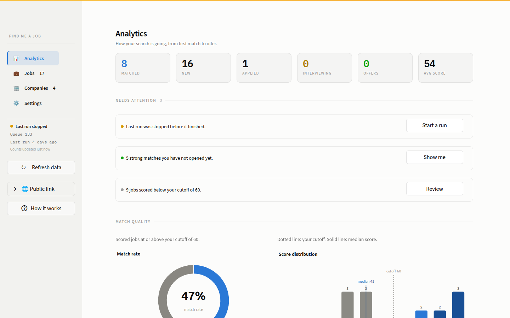
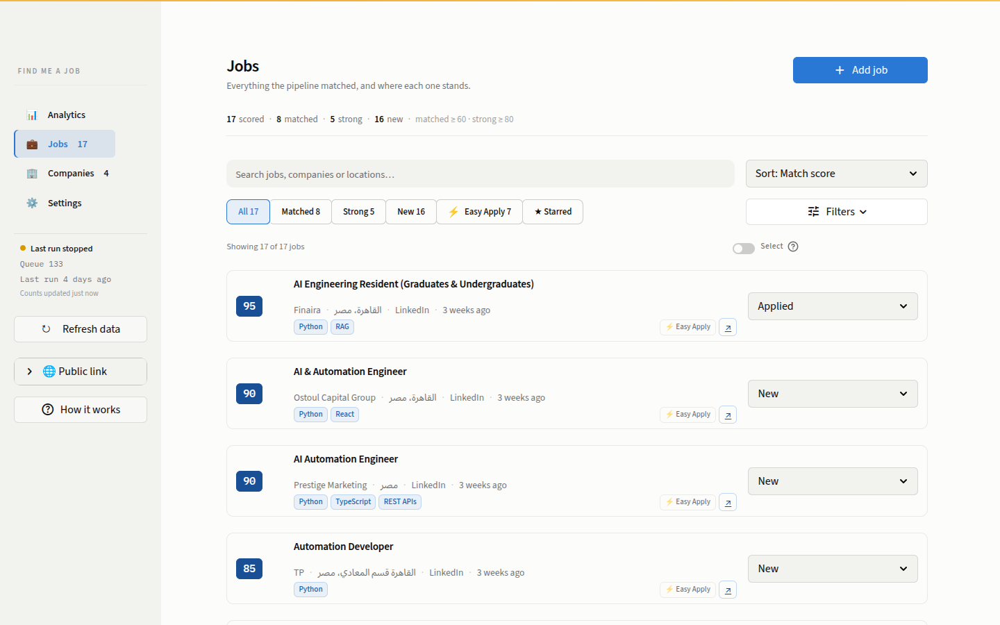
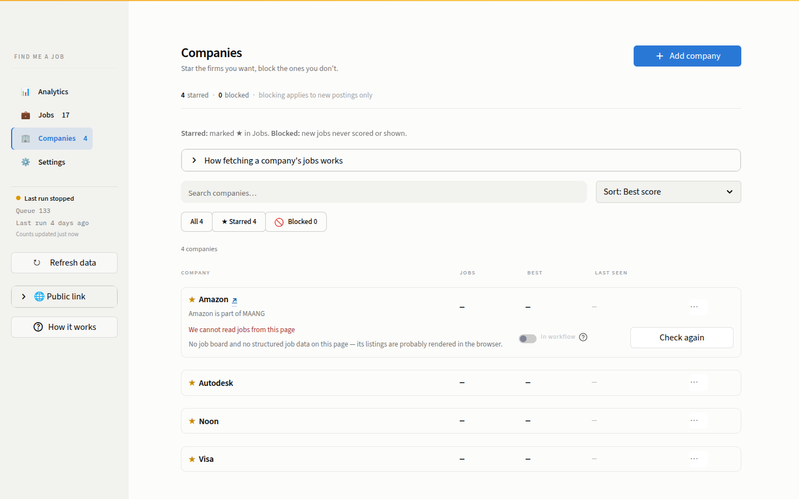
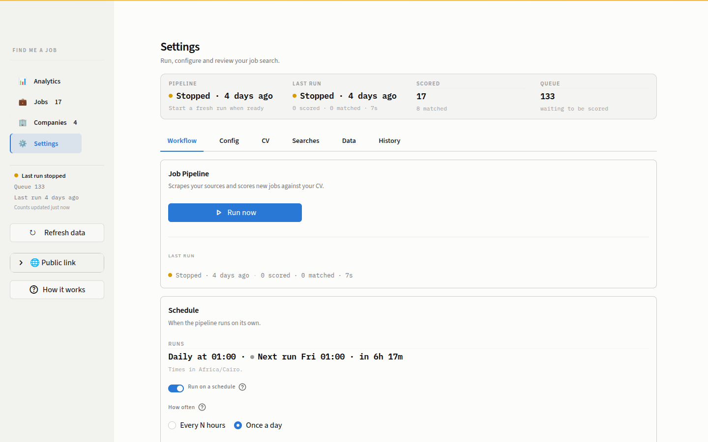
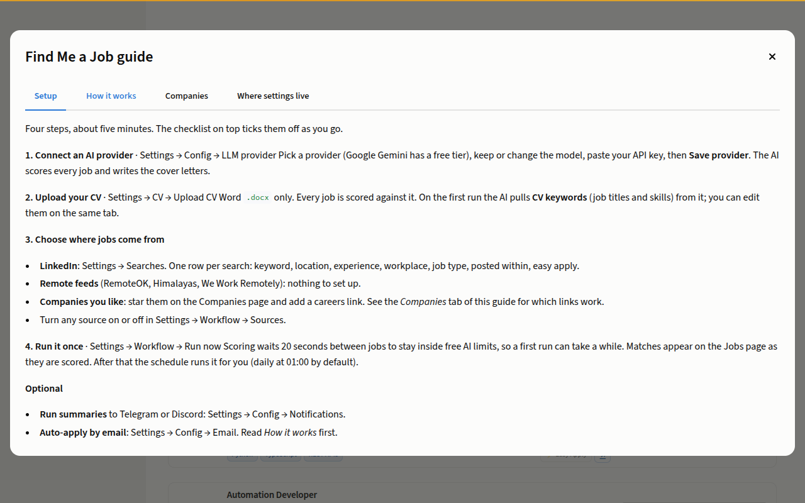

# Find Me a Job

Collects job postings on a schedule, scores each one against your CV with an AI model, writes
cover letters for the good ones, and lets you track applications in a local dashboard.
Everything runs on your machine in Docker.

| Analytics | Jobs |
|:---:|:---:|
|  |  |
| **Companies** | **Settings** |
|  |  |

- [Features](#features)
- [Quick start](#quick-start)
- [First-time setup](#first-time-setup)
- [Using the dashboard](#using-the-dashboard)
- [How a run works](#how-a-run-works)
- [Company careers pages](#company-careers-pages)
- [Choosing an AI provider](#choosing-an-ai-provider)
- [Configuration](#configuration)
- [Commands](#commands)
- [API](#api)
- [Data model](#data-model)
- [License](#license)

---

## Features

- **Five sources**: LinkedIn searches, RemoteOK, Himalayas, We Work Remotely, and the careers
  pages of companies you pick. Each can be switched on or off.
- **AI scoring** from 0 to 100 against your CV, with a cover letter for every match.
- **Low cost**: duplicates across sources are dropped, and remote-feed jobs are checked against
  your CV keywords for free before any of them costs an AI call.
- **Dashboard**: analytics, a filterable job list, application status tracking, starred and
  blocked companies, CSV/JSON export and database backup.
- **Everything configurable in the browser**: AI provider, schedule, sources, CV, searches.
- **Notifications** to Telegram or Discord after each run.
- **Optional auto-apply**: emails employers who ask for applications by email, with your CV
  attached.
- **Public link** via a Cloudflare quick tunnel, so you can open the dashboard from your phone.

## Quick start

You need [Docker with Compose](https://docs.docker.com/get-docker/), an API key from any
OpenAI-compatible AI provider ([see below](#choosing-an-ai-provider)), and your CV as `.docx`.

```bash
git clone https://github.com/MohamedMamdouh18/Find-Me-Job.git
cd Find-Me-Job
cp .env.example .env && chmod 600 .env
sed -i "s/^APP_UID=.*/APP_UID=$(id -u)/" .env   # containers must own ./data
cp /path/to/your-cv.docx cv.docx                  # or: cp cv.docx.example cv.docx, upload later
cp params/linkedin_searches.txt.example params/linkedin_searches.txt
docker compose up -d --build
```

Open [http://localhost:8501](http://localhost:8501). The first download is about 230 MB.

Never start the stack with `sudo`: it leaves root-owned files in `data/` that the containers
cannot read afterwards.

## First-time setup

A **Getting started** checklist shows on every page until these are done. **How it works** in
the sidebar opens a guide covering the same steps, how a run works, and where each setting is.

1. **Add your AI key**: Settings → Config → LLM provider. Pick a provider, paste the key, save.
2. **Check your CV**: Settings → CV. Upload or replace it. Job titles and skills are pulled from
   it on the first run, and you can edit them there.
3. **Choose sources**:
   - LinkedIn: Settings → Searches, one row per search.
   - Remote feeds need no setup. Turn sources on or off in Settings → Workflow → Sources.
   - Company careers pages: see [Company careers pages](#company-careers-pages).
4. **Run once**: Settings → Workflow → **Run now**. Scoring waits 20 seconds between jobs to
   stay within free AI limits, so the first run takes a while. After that it runs daily at
   01:00 (changeable in Settings → Workflow → Schedule).



## Using the dashboard

- **Analytics**: your numbers, a *Needs attention* list with one-click actions, and charts for
  match rate, scores, your application funnel and activity.
- **Jobs**: every scored job with quick views (Matched, Strong, New, Easy Apply, Starred),
  search and filters. Set a status (Applied, Interview, Offer...) straight from the row. Open a
  job for the full description, the cover letter (with PDF export), and its status history.
  *Why this scored* lists CV skills the posting mentions; it is a keyword check, not the AI's
  reasoning.
- **Companies**: **Star** a company to mark its jobs with ★. **Block** one and its new jobs are
  never scored; jobs already scored stay, tagged Blocked. Starred companies can have a careers
  link that is fetched directly.
- **Settings**:

  | Tab | What is there |
  |---|---|
  | Workflow | Run now, pause, stop, resume; schedule and clean-up; sources on/off; jobs per run and per source |
  | Config | AI provider, model and key; match cutoff and delay between jobs; email account and auto-apply; Telegram and Discord |
  | CV | Upload, download, edit CV keywords |
  | Searches | LinkedIn searches, We Work Remotely categories, the keyword-extraction prompt |
  | Data | Export CSV/JSON, database backup, delete all jobs |
  | History | Past runs with their event logs |

Words used across the app:

| Word | Meaning |
|---|---|
| Queued | Collected, waiting to be scored |
| Scored | Rated by the AI |
| Matched | Scored at or above your match cutoff (default 60) |
| Strong | Scored 80 or more |
| New | You have not set a status yet |

> **The public link has no login.** Anyone who has it can see your jobs and CV and use
> Settings, including deleting data. The URL is in the sidebar under **Public link**, and is
> sent to Telegram or Discord when the stack starts.
>
> 

## How a run works

1. **Collect** from every enabled source. Company careers pages go first, so when the same role
   is also in a feed, the company's own copy (original description, real application form) is
   the one kept.
2. **Skip** jobs seen in earlier runs and jobs from blocked companies. The same role from two
   sources counts once: company, title and location are normalised, so "Acme, Inc." and "ACME"
   are one employer.
3. **Filter remote-feed jobs** (RemoteOK, Himalayas, We Work Remotely) by your CV keywords. A
   title match is worth 10 points and each CV skill in the posting 3; a job needs 6. This is
   free, no AI call. LinkedIn searches and company pages skip this filter, since you chose them.
   With no CV keywords, every feed job is dropped.
4. **Cap** the intake: 80 jobs per source and 200 per run by default (Settings → Workflow).
5. **Score** each job against your CV, one at a time, waiting between jobs (20 s default).
   At or above the match cutoff the job is **Matched** and gets a cover letter.
6. **Notify** your configured Telegram or Discord with a summary.

Each source reports how many jobs it offered, kept and dropped in Settings → History.

**Scoring.** The AI sees your CV text, the job description and today's date
(prompt: `params/llm_scoring.txt`) and returns `{"score": 78, "coverLetter": "..."}`.

| Factor | Effect on score |
|---|---|
| Required skills in your CV | High positive |
| Required skills missing | Negative |
| Nice-to-have skills present | Small bonus |
| Experience 1–2 years short | Slight penalty |
| Experience 3+ years short | Score 0 |

The cover letter is a two-paragraph body without name or signature.

**CV keywords.** Up to 5 job titles and 20 skills pulled from your CV by the AI
(prompt: `params/llm_keywords_extract.txt`). Extracted once and reused until the CV changes.
Edit, add or clear them in Settings → CV; **Re-extract from CV** deletes them so the next run
extracts them again.

**Auto-apply by email** (off by default, Settings → Config → Email). When a matched job's
description asks for applications by email, a second AI call (`params/llm_email.txt`) finds the
address and writes the email. It is sent from your SMTP account with `cv.docx` attached, and the
job's status becomes *Email sent*. Real emails cannot be recalled, so read a few generated cover
letters first. Gmail needs an [app password](https://myaccount.google.com/apppasswords).

**Pause, stop, resume.** **Pause** lands between jobs and keeps the queue; scheduled runs wait
while the workflow is paused. **Resume** scores what is left without collecting again.
**Stop** ends the run at once and cannot be resumed; leftover jobs are scored by the next run.

**Schedule and clean-up.** Runs either once a day at a set time (default 01:00) or every 1, 2,
3, 4, 6, 8 or 12 hours at a set minute. Changes apply immediately, no restart. A run already in
progress is not affected, and a second trigger during a run is skipped. A computer that was
asleep at the scheduled time runs the job when it wakes, within an hour. Once a day (default
00:00) jobs, runs and logs older than *Keep jobs for* (default 60 days) are deleted; companies
are kept. Clean-up and runs never overlap: whichever starts second waits or moves to the next
day.

## Company careers pages

Add a careers link to a starred company (Companies → Add company, or edit a row). The link is
checked once in the background and the row shows the result:

| Careers link | Result |
|---|---|
| Greenhouse: `boards.greenhouse.io/acme`, `job-boards.greenhouse.io/acme` | Read through Greenhouse's job board API. Most reliable |
| Lever: `jobs.lever.co/acme` | Read through Lever's API |
| Ashby: `jobs.ashbyhq.com/acme` | Read through Ashby's API |
| A company page that links to or embeds one of those boards | The board is detected and read |
| A page with structured job data (JSON-LD `JobPosting`, the kind Google Jobs reads) | Read from that data. Can break when the site is redesigned |
| Workday, SmartRecruiters, other systems, pages that load jobs with JavaScript | Not readable; the row says why |
| A site whose `robots.txt` disallows the page | Not read, on purpose |

Best link: open the company's job list; if the address is on greenhouse.io, lever.co or
ashbyhq.com, paste that one.

- **In workflow**: fetch this company on every run. Available once the page is readable, and
  needs the *Company boards* source on.
- **Scrape now**: fetch once, right away, with or without *In workflow*.
- **Check again**: re-test a page that could not be read. Two empty fetches in a row mark a
  company unreadable.

Pages are never handed to the AI to extract jobs, because it could invent postings.

## Choosing an AI provider

Any OpenAI-compatible chat completions API works. Pick a preset or **Custom** in
Settings → Config → LLM provider.

| Provider | Endpoint | Example model | Free tier |
|---|---|---|---|
| Google Gemini (default) | `https://generativelanguage.googleapis.com/v1beta/openai/chat/completions` | `gemini-2.5-flash` | Yes |
| Groq | `https://api.groq.com/openai/v1/chat/completions` | `llama-3.3-70b-versatile` | Yes |
| OpenRouter | `https://openrouter.ai/api/v1/chat/completions` | `meta-llama/llama-3.3-70b-instruct` | Some models |
| OpenAI | `https://api.openai.com/v1/chat/completions` | `gpt-4o` | No |
| Anthropic | `https://api.anthropic.com/v1/chat/completions` | `claude-sonnet-4-5` | No |
| Together | `https://api.together.xyz/v1/chat/completions` | `meta-llama/Llama-3.3-70B-Instruct-Turbo` | No |
| Ollama (local, Custom) | `http://host.docker.internal:11434/v1/chat/completions` | `llama3` | N/A |

Paid models give noticeably better scores and cover letters.

**Tokens per job:**

| AI call | When | Tokens |
|---|---|---|
| Scoring and cover letter | Every queued job | ~1,700–2,700 |
| Email writing | Matched job asking for email applications, auto-apply on | +~1,200–2,200 |
| Keyword extraction | Once per CV | small |

## Configuration

**Settings live in the dashboard** and are stored in the database. Most apply from the next run; schedule changes apply at once.

**`.env`** is read at startup only for these:

| Key | Purpose |
|---|---|
| `GENERIC_TIMEZONE` | Timezone for the schedule and timestamps, e.g. `Europe/Berlin` |
| `APP_UID` | Your host user id (`id -u`); the containers run as this user |
| `API_PORT`, `DASHBOARD_PORT` | Host ports, default 8001 and 8501. Change them if already in use |

Apply changes with `docker compose up -d`. The other keys in `.env.example` (AI key, schedule,
email, notifications...) are optional seeds copied into the database on the very first start;
after that, editing them in `.env` has no effect.

**Files in `params/`**, editable in a text editor or from the dashboard:

| File | Purpose |
|---|---|
| `linkedin_searches.txt` | Your LinkedIn searches (Settings → Searches) |
| `llm_scoring.txt` | Scoring and cover-letter prompt |
| `llm_keywords_extract.txt` | CV keyword prompt (Settings → Searches) |
| `llm_email.txt` | Application email prompt |

`linkedin_searches.txt` format, one object per search:

```json
{
  "searches": [
    {
      "Keyword": "Software Engineer",
      "Location": "Berlin, Germany",
      "Experience Level": "Entry level, Associate",
      "Remote": "Remote, Hybrid, On-Site",
      "Job Type": "Full-time",
      "Last Posted": "r604800",
      "Easy Apply": ""
    }
  ]
}
```

`Experience Level`, `Remote` and `Job Type` accept comma-separated values. `Last Posted`:
`r86400` (24 hours), `r604800` (week), `r2592000` (month), or empty for any time. Any non-empty
`Easy Apply` enables it.

**Notifications.** Telegram needs a bot token from [@BotFather](https://t.me/BotFather) and your
chat id from [@get_id_bot](https://t.me/get_id_bot). Discord needs a channel webhook URL; treat
it like a password.

**Network access.** The dashboard is on port 8501 and, through the Cloudflare tunnel, on a public
`trycloudflare.com` URL. The API is bound to `127.0.0.1` and has no authentication.

**Data** lives in `data/db/jobs.db` (SQLite). Download a backup from Settings → Data; to restore,
stop the stack, replace the file, and start it again.

## Commands

```bash
docker compose up -d --build            # start, or rebuild after updating the code
docker compose down                     # stop
docker compose down -v                  # stop and delete all data
docker compose logs -f python-api       # live pipeline log
curl -X POST http://127.0.0.1:8001/api/runs/trigger    # start a run
curl http://127.0.0.1:8001/api/runs/current            # live run progress
docker compose exec python-api python -m pytest tests  # unit and API tests
```

`full-stack-tests/` drives the running dashboard with Playwright (needs Node on the host). It
writes temporary `qa-e2e-*` rows to the live database and deletes them afterwards:

```bash
cd full-stack-tests && npm install && npx playwright install chromium && npx playwright test
```

## API

Base URL `http://localhost:8001`. Interactive docs at
[http://localhost:8001/docs](http://localhost:8001/docs). `GET /health` returns
`{"status": "ok"}`.

**Jobs** `/api/jobs`

| Method | Path | Notes |
|---|---|---|
| GET | `/exists?jobid=` | `{"exists": bool}` |
| GET / POST | `/pending` | List / add a queued job. POST applies the blocklist and dedupe |
| GET | `/pending/count` | Queue size |
| GET | `/filtered` | Scored jobs. Filters `ai_status`, `user_status`, `easy_apply`, `min_score`, `max_score`, `search`, `company`, `website`, `location`, `starred_only`; `sort_by`, `sort_order`, `page`, `page_size` (max 200). `include_body=false` drops description and cover letter; `include_keywords=true` adds matched CV skills |
| POST | `/filtered` | Add or update a scored job |
| DELETE | `/filtered?confirm=delete-all-jobs` | Delete every scored job |
| GET | `/filtered/options` | Distinct companies and websites |
| GET / DELETE | `/filtered/{id}` | One job |
| PATCH | `/filtered/{id}/status` | `{"user_status": "applied"}`. 404 if missing |
| GET | `/filtered/{id}/history` | Status timeline |
| GET | `/filtered/{id}/match` | `{matched, missing, skills_known}` keyword overlap |
| GET | `/stats`, `/stats/funnel`, `/stats/by-source`, `/stats/score-distribution` | Aggregates |
| GET | `/stats/daily-applied?days=7` | Applications per day (max 730) |
| GET | `/stats/top-companies?limit=20` | Job count, best score, last seen (max 100) |
| GET | `/export?format=csv\|json&include_body=false` | Export |

**CV** `/api/cv`

| Method | Path | Notes |
|---|---|---|
| GET | `/` | CV text |
| GET | `/info`, `/file` | Size and date / download `cv.docx` |
| POST | `/upload` | Multipart `.docx`, validated before replacing |
| GET | `/check/{cv_hash}` | Whether keywords exist for this CV |
| GET / POST | `/keywords` | Read / store the keyword cache |
| PUT | `/keywords` | `{"titles": [], "skills": []}`. Trimmed, de-duplicated, blanks dropped. 409 without a CV; 422 on more than 300 per list or 100 characters per keyword |
| DELETE | `/keywords` | Forget keywords; the next run extracts them again |

**Companies** `/api/starred`, `/api/blocked`, `/api/companies`

| Method | Path | Notes |
|---|---|---|
| GET / POST | `/api/starred`, `/api/blocked` | List (`?search=`) / add `{"company_name", "careers_url" or "reason", "notes"}`. 409 if present; 422 on a blank name or non-http(s) `careers_url` |
| GET | `/api/starred/names`, `/api/blocked/names` | All names, lowercase |
| GET | `/api/starred/check?company=`, `/api/blocked/check?company=` | Membership |
| POST | `/api/starred/toggle`, `/api/blocked/toggle` | Add if missing, remove if present |
| PATCH / DELETE | `/api/starred/{id}`, `/api/blocked/{id}` | Update / remove |
| GET | `/api/companies` | Every company with its careers-page result and `in_workflow` |
| PATCH | `/api/companies/{id}` | `in_workflow`, `starred`, `careers_url`. 409 turning on `in_workflow` for an unreadable page; a new URL is checked again |
| POST | `/api/companies/{id}/scrape` | Fetch now: `{queued, already_seen, blocked, found, over_cap}` |
| POST | `/api/companies/{id}/detect` | Re-check the careers link |

**Runs** `/api/runs`

| Method | Path | Notes |
|---|---|---|
| GET | `/?limit=20` | Recent runs |
| POST | `/trigger`, `/pause`, `/stop`, `/resume` | 202; 409 when there is nothing to pause, stop or resume |
| GET | `/current` | Live progress or `null` |
| GET | `/{id}/events` | Event log of one run |

**Settings and more**

| Method | Path | Notes |
|---|---|---|
| GET / PUT | `/api/settings` | All settings; partial update. Secrets are never returned, only whether they are set. On a secret `""` keeps it and `null` clears it |
| POST | `/api/settings/notifications/test` | `{"channel": "telegram"}` or `"discord"` |
| GET / PUT | `/api/settings/schedule` | `{"enabled", "mode": "daily"\|"interval", "at_time": "01:00", "every_n_hours", "at_minute", "retention_at_time"}` |
| GET | `/api/sources` | Sources and whether each is on |
| PUT | `/api/sources/{name}` | `{"enabled": false}` |
| GET / PUT | `/api/params/{name}` | Read / replace `params/{name}.txt` (existing files, 256 KB max) |
| GET | `/api/params/dashboard-url` | Public tunnel URL (404 until ready) |
| POST | `/api/email/send` | `{"recipient", "subject", "body"}`, CV attached |
| GET | `/api/backup` | Consistent copy of `jobs.db` |

## Data model

SQLite at `data/db/jobs.db`, open it with any SQLite client. The schema is migrated
automatically on every start.

| Table | Holds |
|---|---|
| `pending_jobs` | The queue: collected, not scored yet |
| `filtered_jobs` | Scored jobs: score, cover letter, `ai_status` (`fit` / `not_fit`), `user_status` |
| `job_status_history` | Every status change; feeds the funnel and activity calendar |
| `seen_jobs` | Jobs already collected, so they are not fetched twice |
| `starred_companies` | All companies: starred, careers link, careers-page result, `in_workflow` |
| `blocked_companies` | Blocked companies with reason |
| `cv_keywords` | CV titles and skills, tied to the CV version |
| `sources` | Which sources are on |
| `app_settings` | All settings |
| `workflow_runs`, `run_events` | Run history and logs |

Statuses: `new`, `applied`, `email_sent`, `referral`, `assessment`, `interview`, `offer`,
`rejected`, `wont_apply`. Analytics counts `applied`, `email_sent` and `referral` as applied.
Runs are `running`, `success`, `failed`, `paused` or `stopped`, triggered by `schedule`,
`manual` or `resume`.

## License

MIT, see [LICENSE](LICENSE).
